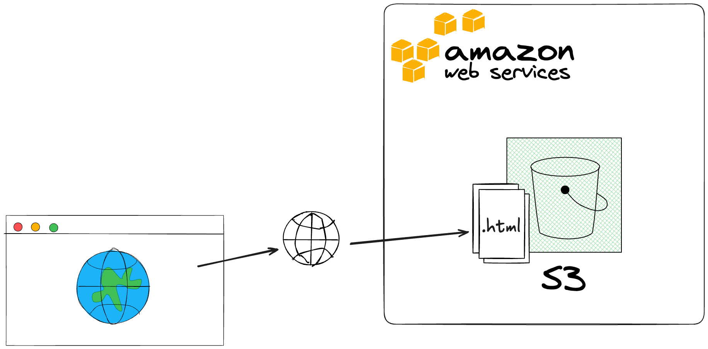
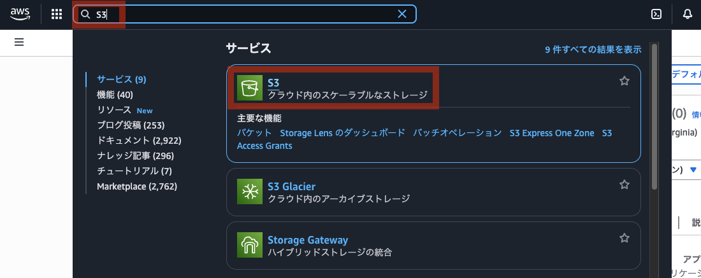
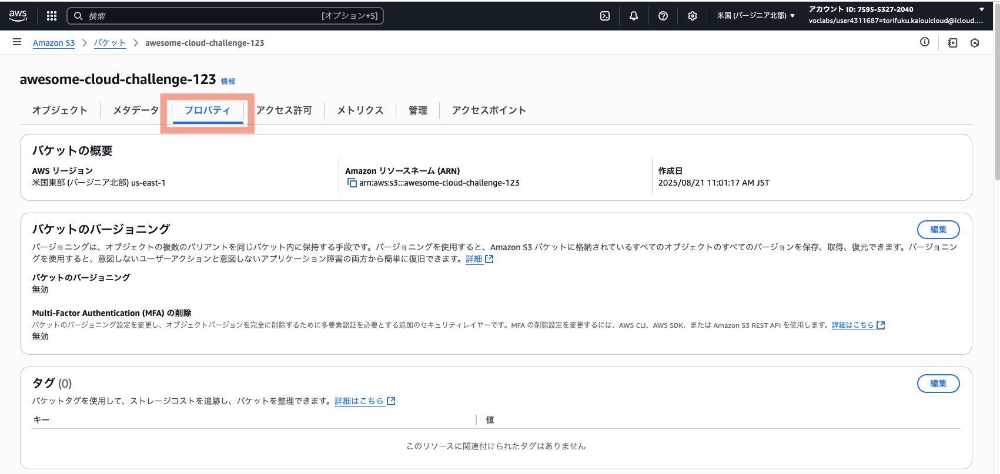
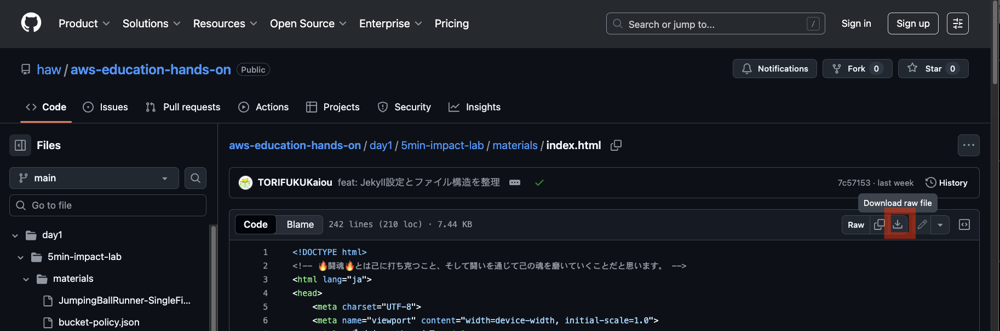
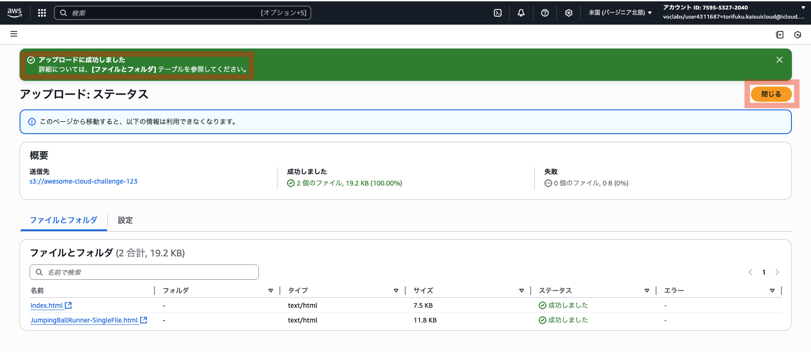
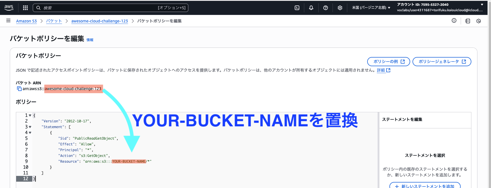
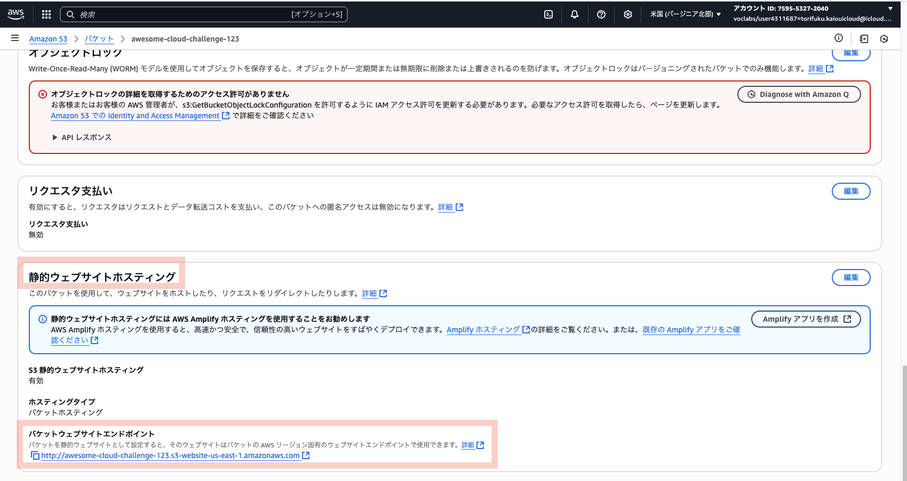

# 🚀 Day 1: Amazon S3 を使用して静的ウェブサイトをホスティングする

## 🎯 このハンズオンで学ぶこと

- **S3**: オブジェクトストレージサービス
- **静的ウェブサイトホスティング**: S3でのWebサイト公開
- **バケットポリシー**: アクセス権限の設定
- **世界への発信**: 5分で自分のサイトを世界に公開

## 🏗️ 構築するシステム



**動作**: 匿名の挑戦宣言ページを世界に公開し、仲間と共有

## ⏰ 所要時間

約15分

## 📋 前提条件

- AWS Academy Sandbox環境へのアクセス
- 基本的なWebの知識（HTML）

---

## 🚀 Step 1: バケット作成（3分）



1. **S3コンソール**にアクセス
2. 「バケットを作成」をクリック

※ 特に指示がないところは、デフォルト値のまま進めてください。  

### バケット設定
- **バケット名**: `awesome-cloud-challenge-${random-number}`  
  ※バケット名は、グローバルで一意である必要があります  
  ※`${random-number}`は好きな数字に置き換えてください  
  ※例: awesome-cloud-challenge-123
- **リージョン**: デフォルト（us-east-1）

### パブリックアクセス設定
- **「パブリックアクセスをすべてブロック」**: ✅チェックを外す ← 重要！
- ⚠️警告が出ますが「承認します」にチェック
    - 「現在の設定により、このバケットとバケット内のオブジェクトが公開される可能性があることを承認します。」に✅️チェック
- その他はデフォルト設定のまま

3. 「バケットを作成」をクリック

## 🚀 Step 2: 静的ウェブサイトホスティング有効化（2分）

1. 作成したバケット名(下線リンク)をクリック

    

2. 「プロパティ」タブを選択

    

3. 一番下の「静的ウェブサイトホスティング」→「編集」

### ホスティング設定
- **静的ウェブサイトホスティング**: 「有効にする」を選択
- **インデックスドキュメント**: `index.html`
- **エラードキュメント**: `error.html`（任意）

4. 「変更を保存」をクリック

## 🚀 Step 3: 目標記入とHTMLファイルアップロード（5分）

### 目標記入

1. 「<a href="https://github.com/haw/aws-education-materials/blob/main/day1/5min-impact-lab/materials/index.html" target="_blank" rel="noopener noreferrer">index.html</a>」ファイルと「<a href="https://github.com/haw/aws-education-materials/blob/main/day1/5min-impact-lab/materials/JumpingBallRunner-SingleFile.html" target="_blank" rel="noopener noreferrer">JumpingBallRunner-SingleFile.html</a>」の2つの.htmlファイルをダウンロードする

    

2. ダウンロードした`index.html`をテキストエディタ(Visual Studio Code等)で開く
3. `[ここに各自の目標を記入してください]`（201行目） をあなたの目標に書き換え (※ 1分考えて、どうしても思い浮かばなければ、次の「ファイルアップロード」へ進む)

    💡 **例**: `5年後にはフルスタックエンジニアとして世界で活躍したい！`

4. 保存する

### ファイルアップロード

1. 「オブジェクト」タブを選択
2. 「アップロード」→「ファイルを追加」
3. 以下のファイルをアップロード：
   - 編集済みの index.html （目標入り）
   - JumpingBallRunner-SingleFile.html （ゲーム）
4. 「アップロード」ボタンをクリック

**アップロード完了後は「閉じる」で、閉じてよい。**  



## 🚀 Step 4: バケットポリシー設定（5分） ← 最重要！

1. 「アクセス許可」タブを選択
2. 「バケットポリシー」→「編集」
3. 用意された <a href="https://github.com/haw/aws-education-materials/blob/main/day1/5min-impact-lab/materials/bucket-policy.json" target="_blank" rel="noopener noreferrer">bucket-policy.json</a>  の内容をコピーして貼り付け
4. **YOUR-BUCKET-NAME**を実際のバケット名に変更

    例: `"Resource": "arn:aws:s3:::awesome-cloud-challenge-123/*"`  

    

    arn = Amazon Resource Name: AWSリソースを一意に識別するための命名規則  

5. 「変更の保存」(画面下方)

⚠️ **重要**: バケット名の変更を忘れずに！

## 🚀 Step 5: ウェブサイトURL取得と公開（3分）

1. 「プロパティ」タブを選択
2. 「静的ウェブサイトホスティング」セクションを確認
3. 「バケットウェブサイトエンドポイント」のURLをコピー

    

4. ブラウザでアクセス確認
5. **あなたの目標が表示されていることを確認**
6. **URLをチャットで共有** → 講師が画面で紹介します！
7. 🎉 あなたの挑戦宣言が世界に公開されました！


**📚コラム: JumpingBallRunner-SingleFile.html**

```
このゲームはChatGPT-5が制作しました。驚きなのは、数行だけの指示でできあがります。

Prompt: Create a single-page app in a single HTML file with the following requirements:
- Name: Jumping Ball Runner
- Goal: Jump over obstacles to survive as long as possible.
- Features: Increasing speed, high score tracking, retry button, and funny sounds for actions and events.
- The UI should be colorful, with parallax scrolling backgrounds.
- The characters should look cartoonish and be fun to watch.
- The game should be enjoyable for everyone.

このプロンプトは、OpenAIの公式ページで紹介されています。
https://openai.com/index/introducing-gpt-5/

実行の都度、作られるゲームは少しつづ異なるものができます。
あなたの指示でできあがるゲームはどんなものですか。
```

---

## 🎯 学習ポイント

### **S3の静的ウェブサイトホスティング**
- **グローバル配信**: 世界中からアクセス可能
- **高可用性**: 99.999999999%（イレブンナイン）の耐久性
- **コスト効率**: 使った分だけの従量課金
- **簡単設定**: 数分でWebサイト公開

### **二重のセキュリティ構造**

#### Step 1（パブリックアクセスブロック） = 外堀
- AWSアカウント全体の安全装置
- 「絶対にパブリックアクセスさせない」最終防御線
- これがONだと、どんなポリシーを書いても無効化される

#### Step 4（バケットポリシー） = 内堀
- 具体的なアクセス許可の設定
- 「誰に」「何を」「どこまで」許可するかの詳細ルール

### **なぜこの仕組みなのか**
AWSの設計思想: 「間違ってパブリック公開してしまう事故を防ぐ」

よくある事故:
1. 開発者がバケットポリシーを間違って設定
2. 機密データが世界中に公開される
3. 企業が大問題になる

だからAWSは:
- デフォルト = 全ブロック（安全第一）
- 意図的に2段階で解除させる（慎重な判断を促す）

---

## 🚨 トラブルシューティング

### **403 Forbidden エラー**
- **原因**: バケットポリシーの設定ミス
- **対処**: `bucket-policy.json`のバケット名が正しいか確認

### **404 Not Found エラー**
- **原因**: `index.html`がアップロードされていない
- **対処**: Step 3でファイルアップロードを再実行

### **ウェブサイトにアクセスできない**
- **原因**: パブリックアクセスブロックが有効
- **対処**: Step 1の設定を再確認

### **エンドポイントURLが見つからない**
- **原因**: 静的ウェブサイトホスティングが無効
- **対処**: Step 2の設定を再確認

---

## 🎊 完了！

おめでとうございます！あなたは今、以下を達成しました：

✅ **世界への発信**: 5分で自分のサイトを世界に公開  
✅ **クラウドの体験**: AWSの力を実感  
✅ **セキュリティ理解**: 二重の安全装置の仕組み理解  
✅ **仲間との絆**: 挑戦宣言の共有でクラス内の結束  

### 🚀 次のステップ

今日の午後は、クラウドの基礎概念を学び、明日からは本格的なシステム構築に挑戦します！

### 🎮️ ボーナス: 息抜きタイム

あなたのサイトには、学習の合間に楽しめる**Jumping Ball Runner**ゲームも含まれています！スペースキーでジャンプして障害物を避けるシンプルなゲームです。

### 💡 今日の気づきを記録しよう

- 5分前まで知らなかったAWSで、もう世界に発信している驚き
- クラウドの力とセキュリティの重要性
- 仲間の挑戦宣言から受けた刺激
- ゲームでの息抜きと仲間との交流

**これがクラウドの力。あなたの挑戦が今、世界に届きました！** 🔥
