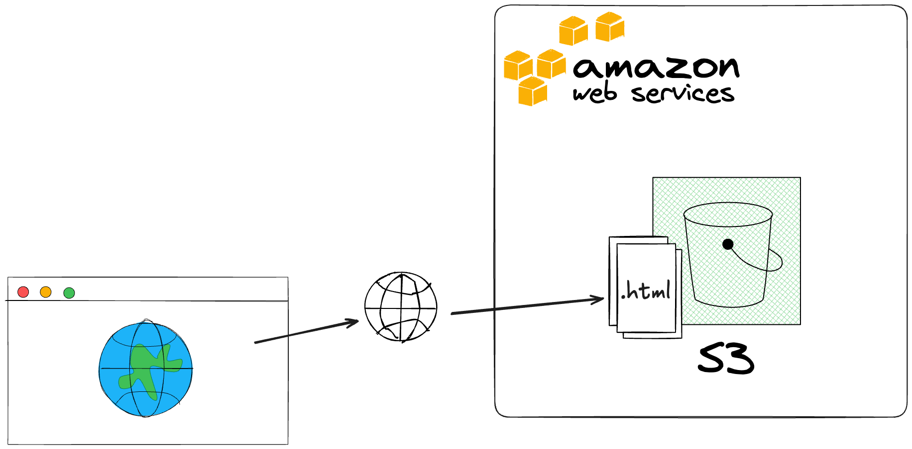
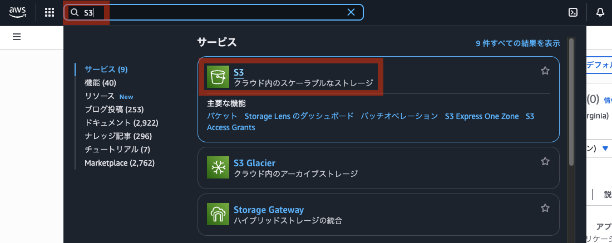
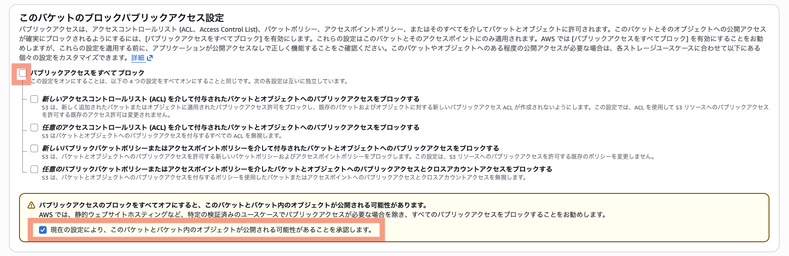
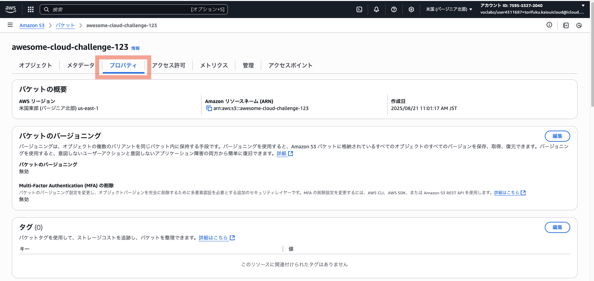
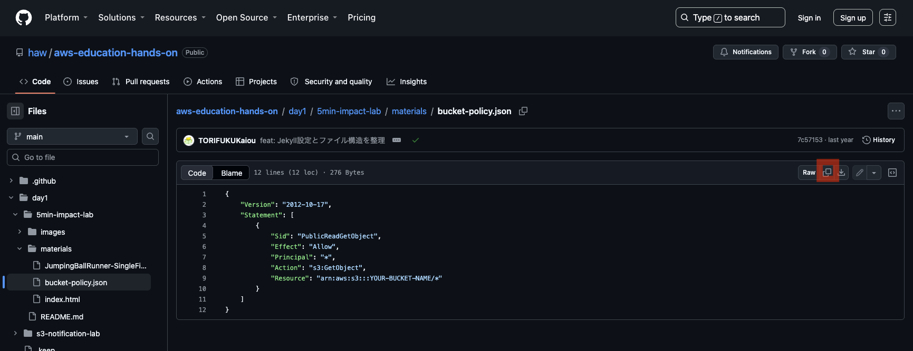
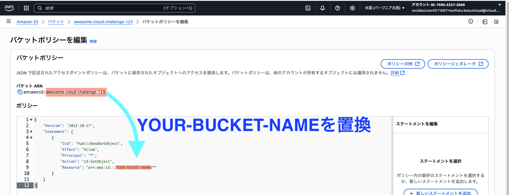
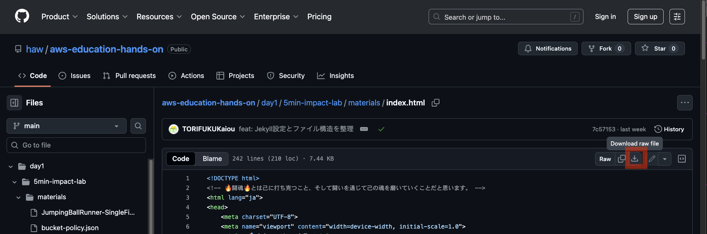
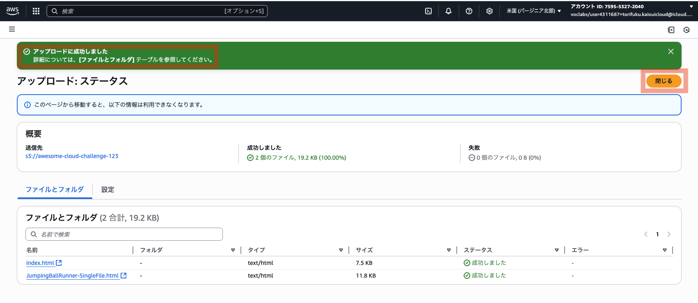
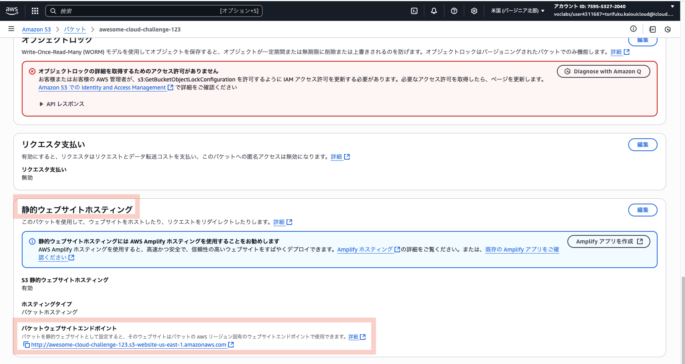

# 🚀 Day 1: Amazon S3 を使用して静的ウェブサイトをホスティングする

## 🎯 このハンズオンで学ぶこと

- **S3**: オブジェクトストレージサービス
- **静的ウェブサイトホスティング**: S3でのWebサイト公開
- **バケットポリシー**: アクセス権限の設定
- **公開と更新**: 自分のサイトを公開し、内容の変更を反映

## 🏗️ 構築するシステム



**動作**: 匿名の挑戦宣言ページを世界に公開し、仲間と共有

## 📋 前提条件

- AWS Academy サンドボックス環境へのアクセス
- 基本的なWebの知識（HTML）

---

## 🚀 Step 1: バケット作成



1. **S3コンソール**にアクセス
2. 「バケットを作成」をクリック

※ 特に指示がないところは、デフォルト値のまま進めてください。

### バケット設定
- **リージョン**: デフォルト（us-east-1）のまま変更しない
- **バケット名**: `awesome-cloud-challenge-${random-number}`
  - ※バケット名は、グローバルで一意である必要があります
  - ※`${random-number}`を好きな数字に置き換えてください
  - ※`$`や`{}`は入力せず、数字だけに置き換えます
  - ※例: `awesome-cloud-challenge-123`

### パブリックアクセス設定
- **「パブリックアクセスをすべてブロック」**: ✅チェックを外す ← 重要！
- ⚠️警告が出ますが「承認します」にチェック
    - 「現在の設定により、このバケットとバケット内のオブジェクトが公開される可能性があることを承認します。」に✅️チェック
    
- その他はデフォルト設定のまま

**「バケットを作成」をクリック**

## 🚀 Step 2: 静的ウェブサイトホスティング有効化

1. 「プロパティ」タブを選択

    

2. 一番下の「静的ウェブサイトホスティング」→「編集」

### ホスティング設定
- **静的ウェブサイトホスティング**: 「有効にする」を選択
- **インデックスドキュメント**: `index.html`

**「変更を保存」をクリック**

## 🚀 Step 3: バケットポリシー設定

1. サンプルの<a href="https://github.com/haw/aws-education-materials/blob/main/day1/5min-impact-lab/materials/bucket-policy.json" target="_blank" rel="noopener noreferrer">bucket-policy.json</a> の内容をコピー(下図参照)

    

2. 「アクセス許可」タブを選択
3. 「バケットポリシー」→「編集」
4. 1でコピーした内容を、バケットポリシーの編集画面に貼り付け
5. **YOUR-BUCKET-NAME**を実際のバケット名に変更

    例: `"Resource": "arn:aws:s3:::awesome-cloud-challenge-123/*"`

    ⚠️ **重要**: バケット名の変更を必ず行ってください。

    ⚠️ **重要**: 末尾の `/*` を必ず付けてください。

    

    `arn` は Amazon Resource Name の略で、AWSリソースを一意に識別する名前です。

6. 「変更の保存」をクリック

## 🚀 Step 4: HTMLファイルをそのままアップロードして公開を確認

### HTMLファイルをダウンロード

1. 「<a href="https://github.com/haw/aws-education-materials/blob/main/day1/5min-impact-lab/materials/index.html" target="_blank" rel="noopener noreferrer">index.html</a>」ファイルと「<a href="https://github.com/haw/aws-education-materials/blob/main/day1/5min-impact-lab/materials/JumpingBallRunner-SingleFile.html" target="_blank" rel="noopener noreferrer">JumpingBallRunner-SingleFile.html</a>」の2つの.htmlファイルをダウンロードする

    ダウンロード方法は、リンクをクリックして開いた別タブでダウンロードボタンを押す。(下図参照)
    

### HTMLファイルをそのままアップロード

1. 「オブジェクト」タブを選択
2. 「アップロード」→「ファイルを追加」
3. ダウンロードした次の2つのファイルを、内容を編集せずにアップロード：
   - index.html
   - JumpingBallRunner-SingleFile.html （ゲーム）
4. 「アップロード」ボタンをクリック

**アップロード完了後は「閉じる」をクリックします。**



### 初回の公開を確認

1. 「プロパティ」タブを選択
2. 「静的ウェブサイトホスティング」セクションにある「バケットウェブサイトエンドポイント」のURLをコピー

    

3. コピーしたURLをブラウザで開く
4. ページが表示され、目標欄に`[ここに各自の目標を記入してください]`が表示されることを確認
5. ページ内のゲームへのリンクも開けることを確認

## 🚀 Step 5: 目標を書き込んで再アップロードし、更新を確認

### 目標を書き込む

1. ダウンロードした`index.html`を、メモ帳やVisual Studio Codeなどのテキストエディタで開く
2. `[ここに各自の目標を記入してください]`を、自分の目標に書き換える

    💡 **例**: `5年後にはフルスタックエンジニアとして世界で活躍したい！`

3. ファイルを保存する

### 更新したHTMLファイルを再アップロード

1. 「オブジェクト」タブを選択
2. 「アップロード」→「ファイルを追加」
3. 目標を書き込んだ`index.html`を選択してアップロードする
4. 上書きの確認が表示されたら、上書きを実行する

### 更新を確認

1. Step 4で開いたウェブサイトURLを再読み込みする
2. 書き込んだ目標が表示され、プレースホルダーが消えていることを確認
3. ゲームへのリンクが引き続き開けることを確認
4. **URLをチャットで共有** → 講師が画面で紹介します！
5. 🎉 あなたの挑戦宣言が世界に公開され、更新も反映されました！


**📚コラム: JumpingBallRunner-SingleFile.html**

```
このゲームは、2025年にChatGPT-5を使って制作しました。
驚きなのは、数行だけの指示でできあがります。

Prompt: Create a single-page app in a single HTML file with the following requirements:
- Name: Jumping Ball Runner
- Goal: Jump over obstacles to survive as long as possible.
- Features: Increasing speed, high score tracking, retry button, and funny sounds for actions and events.
- The UI should be colorful, with parallax scrolling backgrounds.
- The characters should look cartoonish and be fun to watch.
- The game should be enjoyable for everyone.

このプロンプトは、OpenAIの公式ページで紹介されています。
https://openai.com/index/introducing-gpt-5/

実行の都度、作られるゲームは少しつづ異なるものができます。
```

---

## 🎯 学習ポイント

### **S3の静的ウェブサイトホスティング**
- **グローバル配信**: 世界中からアクセス可能
- **高可用性**: 99.999999999%（イレブンナイン）の耐久性
- **コスト効率**: 使った分だけの従量課金
- **簡単設定**: ブラウザから設定してWebサイト公開

### **二重のセキュリティ構造**

#### Step 1（パブリックアクセスブロック） = 外堀
- AWSアカウント全体の安全装置
- 「絶対にパブリックアクセスさせない」最終防御線
- これがONだと、どんなポリシーを書いても無効化される

#### Step 3（バケットポリシー） = 内堀
- 具体的なアクセス許可の設定
- 「誰に」「何を」「どこまで」許可するかの詳細ルール

### **なぜこの仕組みなのか**
AWSの設計思想: 「間違ってパブリック公開してしまう事故を防ぐ」

よくある事故:
1. 開発者がバケットポリシーを間違って設定
2. 機密データが世界中に公開される
3. 企業が大問題になる

だからAWSは:
- デフォルト = 全ブロック（安全第一）
- 意図的に2段階で解除させる（慎重な判断を促す）

---

## 🚨 トラブルシューティング

### **403 Forbidden エラー**
- **原因**: バケットポリシーの設定ミス
- **対処**: `bucket-policy.json`のバケット名が正しいか確認

### **404 Not Found エラー**
- **原因**: `index.html`がアップロードされていない
- **対処**: Step 4でファイルアップロードを再実行

### **ウェブサイトにアクセスできない**
- **原因**: パブリックアクセスブロックが有効
- **対処**: Step 1の設定を再確認

### **エンドポイントURLが見つからない**
- **原因**: 静的ウェブサイトホスティングが無効
- **対処**: Step 2の設定を再確認

---

## 🎊 完了！

おめでとうございます！あなたは今、以下を達成しました：

✅ **世界への発信**: S3で自分のサイトを世界に公開
✅ **クラウドの体験**: AWSの力を実感  
✅ **セキュリティ理解**: 二重の安全装置の仕組み理解  
✅ **更新の体験**: HTMLの変更が公開ページに反映されることを確認
✅ **仲間との絆**: 挑戦宣言の共有でクラス内の結束  

### 🚀 次のステップ

今日の後半は、クラウドの基礎概念を学び、明日からは本格的なシステム構築に挑戦します！

### 🎮️ ボーナス: 息抜きタイム

あなたのサイトには、学習の合間に楽しめる**Jumping Ball Runner**ゲームも含まれています！スペースキーでジャンプして障害物を避けるシンプルなゲームです。

### 💡 今日の気づきを記録しよう

- AWSを知ったばかりなのに、もう世界に発信している驚き
- クラウドの力とセキュリティの重要性
- 仲間の挑戦宣言から受けた刺激
- ゲームでの息抜きと仲間との交流

**これがクラウドの力。あなたの挑戦が今、世界に届きました！** 🔥
