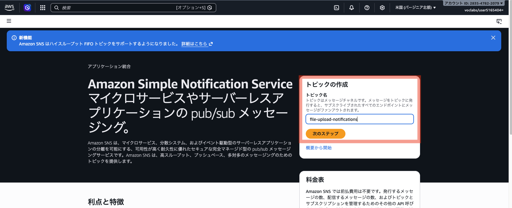
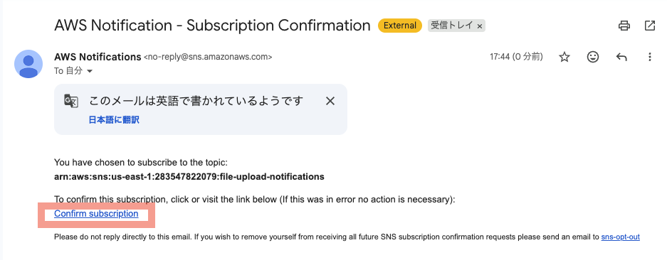
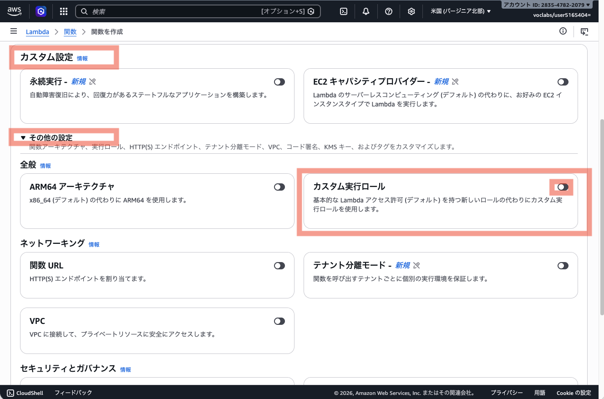
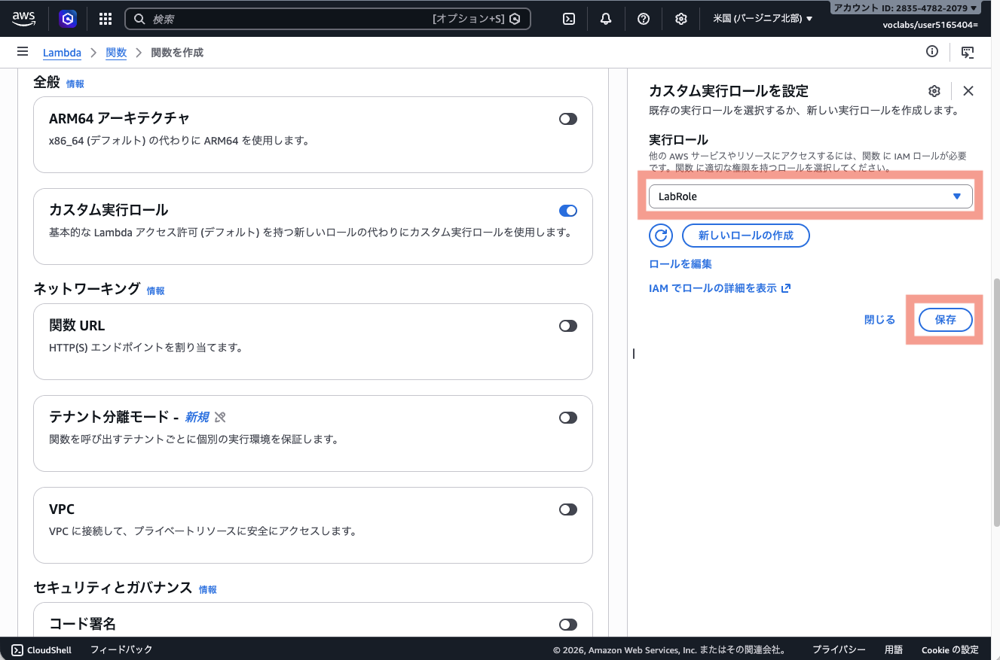
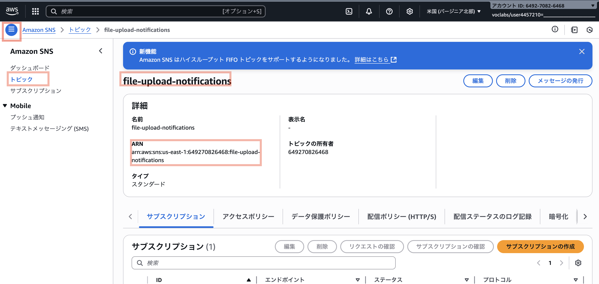
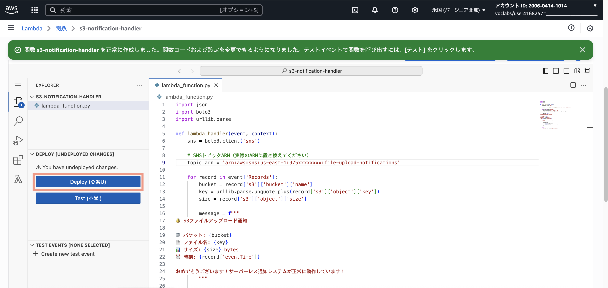
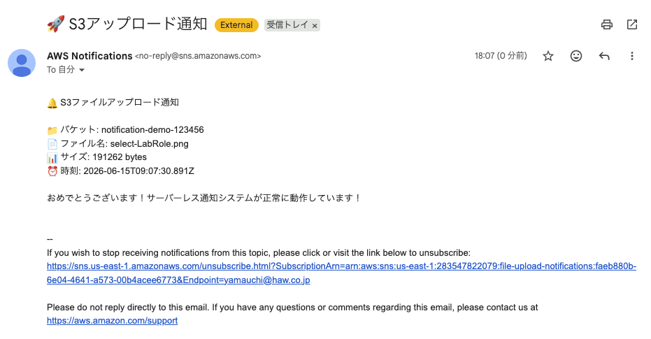

# 🔔 S3自動通知システム ハンズオン

## 🎯 このハンズオンで学ぶこと

- **イベント駆動アーキテクチャ**: ファイルアップロードをトリガーに自動処理
- **サーバーレス**: サーバー管理不要でシステム構築
- **AWS連携**: S3 → <ruby>Lambda<rt>ラムダ</rt></ruby> → SNS（<ruby>Simple Notification Service<rt>シンプル・ノーティフィケーション・サービス</rt></ruby>） の連携パターン
- **実用的な通知システム**: 実際のシステムでよく使われる構成

## ️ 構築するシステム

このハンズオンでは、S3にファイルがアップロードされたことをきっかけに、自動でメール通知を送る仕組みを作ります。

登場する主なサービスは、次の3つです。

- 📁 **S3**：ファイルを保存するストレージサービス
- ⚡ **Lambda**：サーバーを管理せずにプログラムを実行できるサービス。今回は、S3へのアップロードをきっかけに処理を実行します。
- 📧 **SNS**：メッセージを複数の宛先へ配信できる通知サービス。今回は、メール通知に使います。

```
📁 S3バケット → ⚡ Lambda関数 → 📧 SNS → 📬 あなたのメール
```

**動作**: S3にファイルをアップロードすると、自動であなたのメールアドレスに通知が届きます！

## 📋 前提条件

- 受信可能なメールアドレス
- AWS Academy Sandbox環境へのアクセス

💡 **AWS Academy Sandbox対応**: このハンズオンはAWS Academy Sandbox環境で動作確認済みです！

---

## 🚀 手順

### Step 1: SNSトピック作成

1. AWSコンソールで「Simple Notification Service」を検索・選択
2. 「トピックの作成」で、トピック名に `file-upload-notifications` を入力し、「次のステップ」
   
3. **タイプ**: スタンダード
4. **名前**: `file-upload-notifications`
5. 「トピックの作成」(下方)をクリック

### Step 2: メール購読設定

1. 作成したトピック（`file-upload-notifications`）の詳細画面に遷移する
2. 「サブスクリプション」タブ→「サブスクリプションの作成」
3. **プロトコル**: Eメール
4. **エンドポイント**: あなたのメールアドレス
5. 「サブスクリプションの作成」をクリック
6. **重要**: 4で指定したメールに届く確認リンク(`Confirm subscription`)をクリックして購読を確定

   - **メールのタイトル**: `AWS Notification - Subscription Confirmation`

   - **メールの例**:
      


### Step 3: S3バケット作成

1. AWSコンソールで「S3」を検索・選択
2. 「バケットを作成」
3. **バケット名**: `notification-demo-[ランダム数字]`
4. **リージョン**: デフォルト（us-east-1）
5. その他はデフォルト→「バケットを作成」

### Step 4: Lambda関数作成

1. AWSコンソールで「Lambda」を検索・選択
2. 「関数の作成」
3. **関数名**: `s3-notification-handler`
4. **ランタイム**: Python 3.14 または Node.js 24.x (お好きな方を選んでください。どちらか迷ったらPythonを選んでください)
5. カスタム設定 > その他の設定 > **カスタム実行ロール** をONにする
   
6. 「実行ロール」で、 **LabRole** を選択し、「保存」
   

   > **AWS Academy環境ではない方は**: 「基本的な Lambda アクセス権限で新しいロールを作成」を選択し、作成後にSNS Publishの権限を追加してください。

6. 「関数の作成」をクリック

#### Python版コード

<a href="https://github.com/haw/aws-education-materials/blob/main/day1/s3-notification-lab/materials/lambda-python.py" target="_blank" rel="noopener noreferrer">lambda-python.py</a> を参照してください。AWSコンソール上の「コード」タブで、Copy & Pasteしてください。  

#### Node.js版コード

<a href="https://github.com/haw/aws-education-materials/blob/main/day1/s3-notification-lab/materials/lambda-nodejs.js" target="_blank" rel="noopener noreferrer">lambda-nodejs.js</a> を参照してください。AWSコンソール上の「コード」タブで、Copy & Pasteしてください。  

### Step 5: SNSトピックARNの設定

1. 別のタブで、SNSコンソールを立ち上げて `file-upload-notifications` トピックのARNをコピーする

    

2. Lambda関数のコードで `YOUR_TOPIC_ARN_HERE` を実際のSNSトピックARNに置換 (例: arn:aws:sns:us-east-1:975xxxxxxxx:file-upload-notifications)

3. 「Deploy」をクリック

    

### Step 6: S3イベント設定

1. S3コンソールで作成したバケットを選択
2. 「プロパティ」タブ
3. 「イベント通知」→「イベント通知を作成」
4. **名前**: `upload-notification`
5. **イベントタイプ**: 「すべてのオブジェクト作成イベント」にチェック
6. **送信先**: Lambda関数
7. **Lambda関数**: `s3-notification-handler`を選択
8. 「変更の保存」

⚠️ **重要な注意事項**: 

S3の「プロパティ」タブで以下のような赤い警告メッセージが表示される場合があります：

```
オブジェクトロックの詳細を取得するためのアクセス許可がありません
お客様またはお客様の AWS 管理者が、s3:GetBucketObjectLockConfiguration を許可するように IAM アクセス許可を更新する必要があります。
```

**この警告は完全に無視して大丈夫です！**

- **原因**: AWS Academy Sandbox環境の権限制限
- **影響**: 今回のハンズオンには一切影響なし
- **対処**: 何もする必要はありません
- **理由**: オブジェクトロック機能（ファイルの削除・変更を一定期間禁止する機能）は今回使用しないため

赤い警告で驚かれるかもしれませんが、**システムは正常に動作します**。安心して次のステップに進んでください。  

### Step 7: テスト実行

1. S3バケットに任意のファイルをアップロード
2. 数秒後にメールを確認
3. 🎉 通知メールが届いていれば成功！

   

---

## 🎯 学習ポイント

### **イベント駆動アーキテクチャ**
- ファイルアップロードが「イベント」
- Lambdaが「イベントハンドラー」
- 自動的に処理が実行される

### **サーバーレスの利点**
- サーバー管理不要
- 使った分だけ課金
- 自動スケーリング

### **AWS連携パターン**
- S3 → Lambda → SNS は実用的な構成
- 監視、通知、データ処理で頻繁に使用

---

## 🚨 トラブルシューティング

### **メールが届かない**
- SNS購読の確認メールをクリックしたか確認
- スパムフォルダも確認
- Lambda関数のCloudWatchログを確認

### **Lambda関数でエラー**
- SNSトピックARNが正しく設定されているか確認
- IAMロールにSNS権限があるか確認
- CloudWatchログでエラー詳細を確認

### **S3イベントが発火しない**
- イベント通知設定が正しいか確認
- Lambda関数名が正しいか確認

---

## 🎊 完了！

おめでとうございます！あなたは今、実用的なサーバーレス通知システムを構築しました。

この技術は実際のシステムで：
- ファイル処理の完了通知
- システム監視アラート  
- データ更新の通知

などに活用されています。

**次のステップ**: 他のAWSサービスとの連携を学んで、より複雑なシステムを構築してみましょう！