# 💻 Day 2: コンピュート・ネットワーク ハンズオン

## 🎯 このハンズオンで学ぶこと

- **EC2インスタンス**: 仮想サーバの起動と管理
- **VPC**: 自分専用の仮想データセンター構築
- **セキュリティグループ**: 仮想ファイアウォールの設定
- **ネットワーク設計**: パブリック・プライベートサブネットの理解

## 🏗️ 構築するシステム

### Phase 1: Default VPCでの基本体験
```
🌐 インターネット → 🔒 セキュリティグループ → 💻 EC2(Apache)
```

### Phase 2: カスタムVPCでの本格構築
```
🌐 インターネット → 🚪 IGW → 🏢 VPC → 🔒 セキュリティグループ → 💻 EC2(Apache)
```

## ⏰ 所要時間

- Phase 1: 約25分
- Phase 2: 約30分

## 📋 前提条件

- AWS Academy Sandbox環境へのアクセス
- 基本的なWebの知識（HTML、HTTP）

---

## 🚀 Phase 1: Default VPCでEC2起動

### 目標
「まずは簡単に！Default VPCでWebサーバを起動してみよう」

### Step 1: セキュリティグループ作成

1. **EC2コンソール**にアクセス
2. 左側の「ネットワークとセキュリティ」から「セキュリティグループ」を開く
3. 「セキュリティグループを作成」をクリック

#### 基本設定
- **セキュリティグループ名**: `web-server-sg`
- **説明**: `web-server-sg`
- **VPC**: デフォルトVPC

#### インバウンドルール
- **HTTP (ポート80)**: ソース Anywhere-IPv4（0.0.0.0/0）
- SSH (ポート22) は追加しない

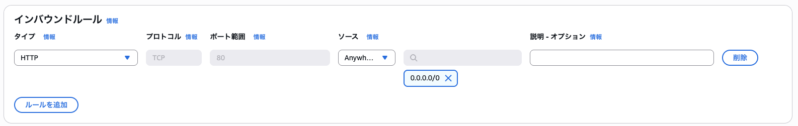

ユーザーデータで Apache HTTP Server（`httpd`）をインストールし、HTTPを使ってWebページを配信します。ブラウザから `http://[パブリックIP]` でアクセスできるように、HTTPの標準ポートであるTCP 80へのインバウンド通信を許可します。

アウトバウンドルールはデフォルトのままにします。

4. 「セキュリティグループを作成」をクリック

### Step 2: EC2インスタンス起動

1. **EC2コンソール**の左側メニューから「インスタンス」→「インスタンス」を開く
2. 「インスタンスを起動」をクリック

#### 基本設定
- **名前**: `my-first-webserver`
- **AMI**: Amazon Linux 2023 AMI

    > 一覧に `Amazon Linux 2023 kernel-6.18 AMI` と `Amazon Linux 2023 kernel-6.1 AMI` の2種類が表示されます。既定で選択されているものをそのまま使ってください。

- **インスタンスタイプ**: t3.micro

#### キーペア（ログイン）

- キーペアなしで続行（推奨されません）

#### ネットワーク設定

「編集」ボタンを押す  

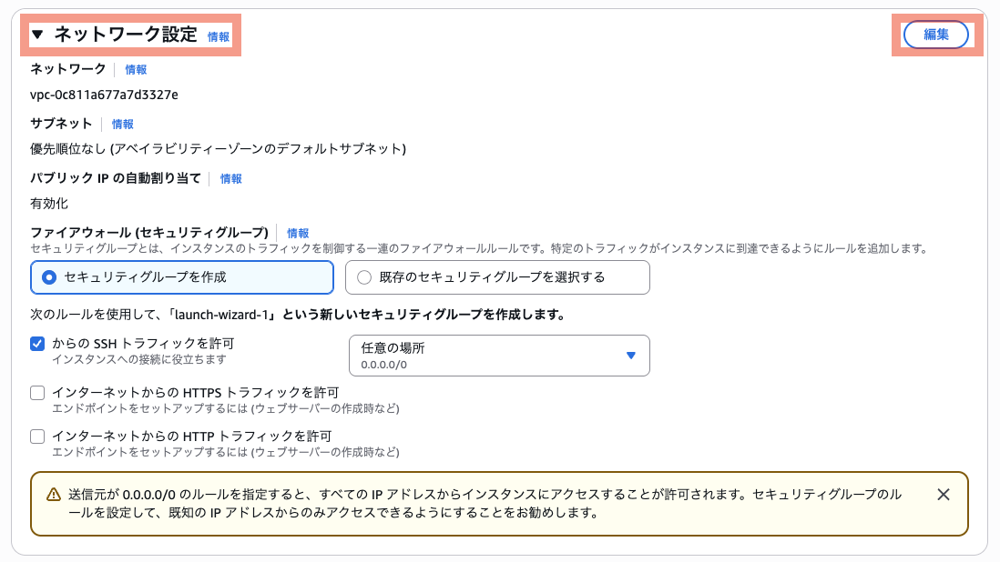

- **VPC**: デフォルトVPC（そのまま）
- **サブネット**: 指定なし（そのまま）
- **アベイラビリティゾーン**: 指定なし（そのまま）
- **パブリックIPの自動割り当て**: 有効化

#### セキュリティグループ
- **既存のセキュリティグループを選択**
- 作成済みの `web-server-sg` を選択

> セキュリティグループはVPCに所属します。ここで選択しているVPCがデフォルトVPCであることを確認してください。

#### ストレージを設定

8GiB (gp3) デフォルトのまま。  


#### 高度な詳細
- **IAMインスタンスプロファイル**: `LabInstanceProfile`
  
  > **AWS Academy環境ではない方は**: セッションマネージャーを使用するため、`AmazonSSMManagedInstanceCore`ポリシーがアタッチされたIAMロールを作成し、インスタンスプロファイルとして設定してください。

- **ユーザーデータ**: <a href="https://github.com/haw/aws-education-hands-on/blob/main/day2/ec2-vpc-lab/materials/user-data-apache.txt" target="_blank" rel="noopener noreferrer">user-data-apache.txt</a> の内容をコピー&ペースト

    `user-data-apache.txt`: Apacheの自動セットアップとカスタムWebページ作成を行うスクリプト  

#### インスタンスを起動

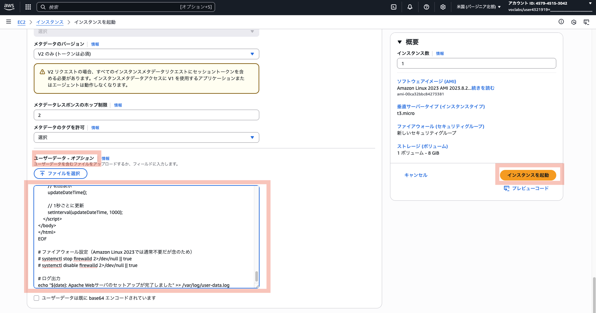

#### すべてのインスタンスを表示

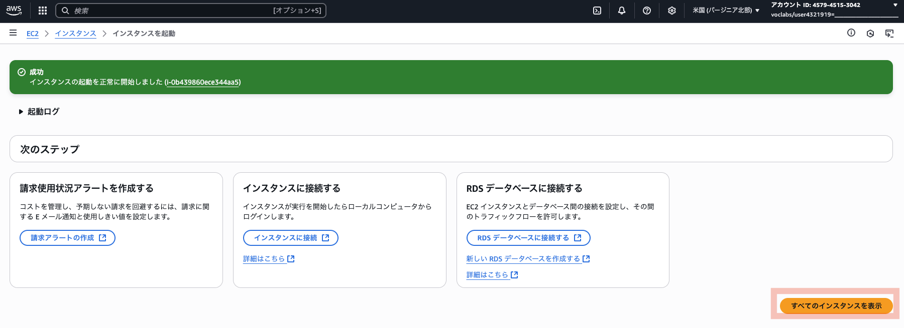

### Step 3: 動作確認

1. インスタンスが「実行中」状態かつステータスチェックが「2/2のチェックに合格しました」になるまで待機 (2分〜5分程度)

    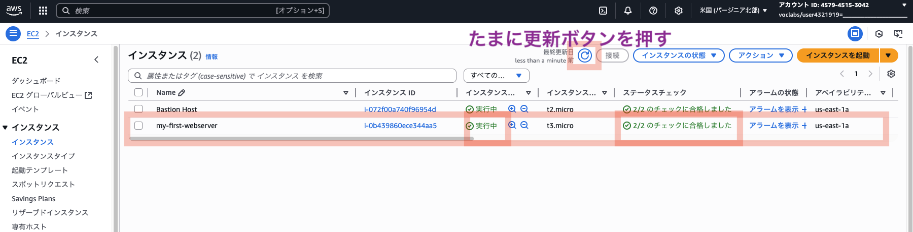  

    参考: [Status checks for Amazon EC2 instances](https://docs.aws.amazon.com/AWSEC2/latest/UserGuide/monitoring-system-instance-status-check.html)  

2. パブリックIPアドレスをコピー

    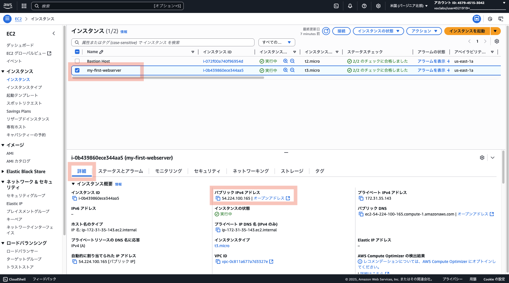

3. ブラウザで `http://[パブリックIP]` にアクセス
4. 🎉 Webページが表示されれば成功！

    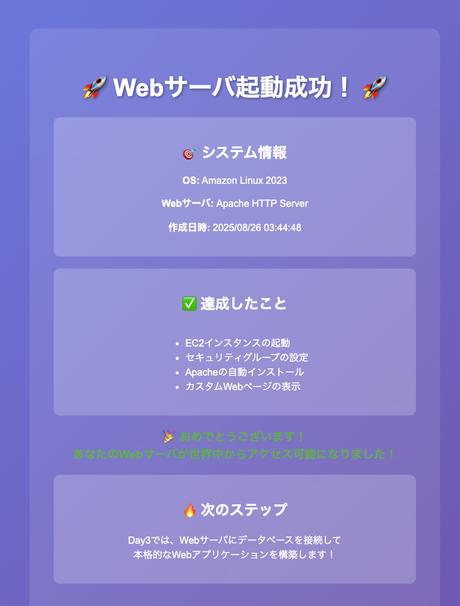

### Step 4: Session Managerで接続体験

1. インスタンスを選択
2. 「接続」→「ウェブブラウザで」→「SSMセッションマネージャー」

    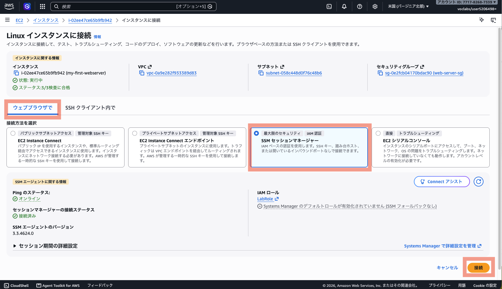

3. 「接続」をクリック
4. ブラウザ内でLinuxコマンドを実行
    ```bash
    sudo su - ec2-user
    sudo cat /var/www/html/index.html
    sudo tail -f /var/log/httpd/access_log
    ```

    ※ `sudo` = superuser do とする説とsubstitute user, doとする説がある  
    ※ `su` = substitute user  
    ※ `ec2-user` = Amazon Linux AMIで作ったマシンに作られるユーザー名  
    ※ `cat` = ファイルの中身を確認するコマンド。  
    ※ `tail` = ファイルの末尾を表示するコマンド。オプションの`-f`は、`--follow`の短縮系で、「output appended data as the file grows（ファイルが育つ（grows）につれて、新しいデータを追いかけて（follow）表示する）」の意味  
    ※ `sudo tail -f /var/log/httpd/access_log` した後、`http://[パブリックIP]` にアクセスし、ブラウザをリロードすると、ログが成長する様子が見える  
    ※ `sudo tail -f /var/log/httpd/access_log` の止め方は、「Ctl + c」  
    ※ 接続した直後のプロンプトは `sh-5.2$`（ユーザーは `ssm-user`）。`sudo su - ec2-user` を実行すると `[ec2-user@ip-172-31-x-x ~]$` に変わる。このプロンプトの変化が、`ec2-user` に切り替わった証拠  
    ※ `access_log` には `/favicon.ico` への `404` や、送信元が `"-"` の `408` が混ざることがあるが、いずれも正常。自分のアクセスが `200` で記録されていれば成功している  
    ※ `access_log` のタイムスタンプは UTC（`+0000`）。Webページに表示される日時は日本時間なので、同じアクセスでも9時間ずれて見える  

---

## 🏗️ Phase 2: カスタムVPCでの本格構築

### 目標
「本格的なネットワーク設計！自分専用のVPCを構築しよう」

### Step 1: VPC作成

1. **VPCコンソール**にアクセス
2. 「VPCを作成」をクリック

    #### VPC設定
    - **作成するリソース**: VPCなど
    - **名前タグの自動生成**: ✅️ チェック ON
    - **名前タグ**: `プロジェクト` => `my-custom` に変更
    - **IPv4 CIDR**: `10.0.0.0/16` (デフォルトのまま)

    #### サブネット設定
    - **アベイラビリティーゾーン数**: 1
    - **パブリックサブネット数**: 1
    - **プライベートサブネット数**: 0

    #### その他設定
    - **NATゲートウェイ**: なし
    - **VPCエンドポイント**: なし

    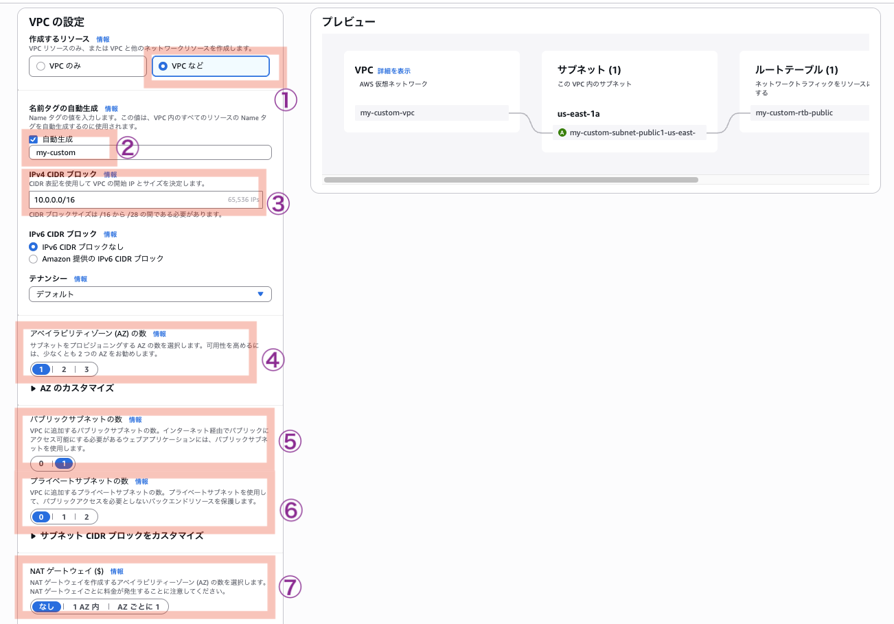

3. 「VPCを作成」をクリック

    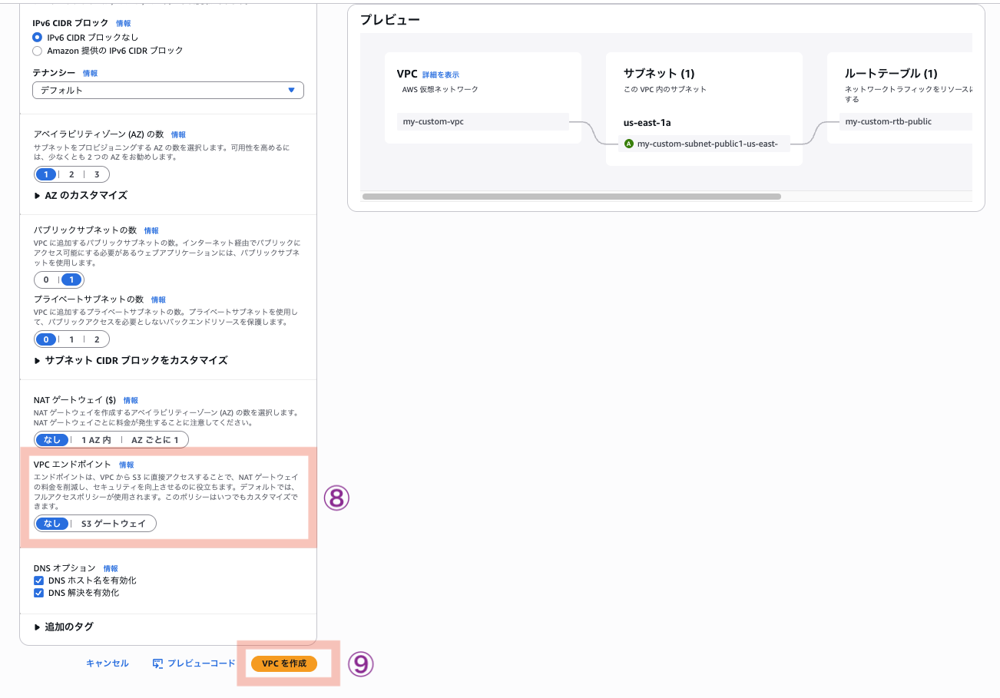

### Step 2: セキュリティグループ作成

1. **EC2コンソール**で、左側の「ネットワークとセキュリティ」から「セキュリティグループ」を開く
2. 「セキュリティグループを作成」をクリック

#### 基本設定
- **セキュリティグループ名**: `custom-web-sg`
- **説明**: `custom-web-sg`
- **VPC**: `my-custom-vpc`（作成したVPC）

#### インバウンドルール
- **HTTP (ポート80)**: ソース Anywhere-IPv4（0.0.0.0/0）
- SSH (ポート22) は追加しない


ユーザーデータで Apache HTTP Server（`httpd`）をインストールし、HTTPを使ってWebページを配信します。ブラウザから `http://[パブリックIP]` でアクセスできるように、HTTPの標準ポートであるTCP 80へのインバウンド通信を許可します。

アウトバウンドルールはデフォルトのままにします。

3. 「セキュリティグループを作成」をクリック

### Step 3: カスタムVPCでEC2起動

1. **EC2コンソール**で「インスタンスを起動」

#### 基本設定
- **名前**: `custom-vpc-webserver`
- **AMI**: Amazon Linux 2023 AMI
- **インスタンスタイプ**: t3.micro

#### キーペア（ログイン）

- キーペアなしで続行（推奨されません）

#### ネットワーク設定

「編集」ボタンを押す  

- **VPC**: `my-custom-vpc`（作成したVPC）
- **サブネット**: パブリックサブネットを選択（名前に `public` が入っているもの）
- **パブリックIPの自動割り当て**: ⚠️ **有効化**（既定は「無効化」）

> ### ⚠️ ここが最も間違えやすい箇所です
>
> 「パブリックIPの自動割り当て」の既定値は **無効化** です。必ず **有効化** に変更してください。
>
> - **この設定は、インスタンスの起動後には変更できません。** 有効化を忘れた場合は、インスタンスを作り直すことになります
> - Phase 1 の Default VPC では、サブネット側の設定によって自動的に付与されるため、意識しなくても成功しました。カスタムVPCでは自分で指定する必要があります

#### セキュリティグループ
- **既存のセキュリティグループを選択**
- 作成済みの `custom-web-sg` を選択

> `custom-web-sg` が表示されない場合は、選択中のVPCが `my-custom-vpc` であることを確認してください。

#### ストレージを設定

8GiB (gp3) デフォルトのまま。  

#### 高度な詳細
- **IAMインスタンスプロファイル**: `LabInstanceProfile`
  
  > **AWS Academy環境ではない方は**: セッションマネージャーを使用するため、`AmazonSSMManagedInstanceCore`ポリシーがアタッチされたIAMロールを作成し、インスタンスプロファイルとして設定してください。

- **ユーザーデータ**: <a href="https://github.com/haw/aws-education-hands-on/blob/main/day2/ec2-vpc-lab/materials/user-data-apache.txt" target="_blank" rel="noopener noreferrer">user-data-apache.txt</a>  の内容をコピー&ペースト

#### インスタンスを起動


#### すべてのインスタンスを表示


### Step 4: 動作確認と比較

#### 1. パブリックIPが割り当てられているか確認

インスタンス一覧の「パブリック IPv4 アドレス」列を見てください。

- IPアドレスが表示されている → OK。次に進みます
- `-`（ハイフン）になっている → Step 3 の「パブリックIPの自動割り当て」が有効化されていません。トラブルシューティングの「パブリックIPが割り当てられていない」を参照してください

> ステータスチェックの完了を待つ前に確認できます。

#### 2. 動作確認 (Phase 1と同じ)

- ブラウザで `http://[パブリックIP]` にアクセスし、Webページが表示される
- 「接続」→ Session Manager で接続し、`sudo su - ec2-user` を実行する
    - プロンプトのホスト名が **`ip-10-0-x-x`** になっていることを確認します
    - Phase 1 では `ip-172-31-x-x` でした。VPCのCIDRがそのままホスト名に現れるため、別のネットワーク上にいることが確認できます

#### 3. Default VPCとカスタムVPCの違いを確認

VPCコンソール →「お使いのVPC」→ 各VPCを選択 →「リソースマップ」タブで見比べ、以下の表を埋めてください。

| 項目 | Default VPC | カスタムVPC |
|---|---|---|
| IPv4 CIDR | | |
| サブネット数 | | |
| ルートテーブルの `0.0.0.0/0` のターゲット | | |
| インスタンスのプライベートIP | | |
| セキュリティグループの所属VPC | | |

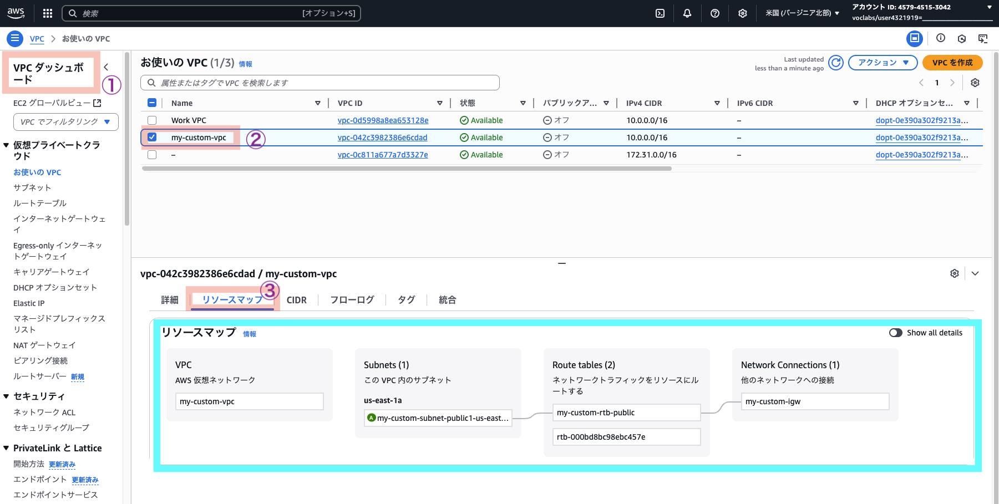

*↑ カスタムVPCのリソースマップ。VPC・サブネット・ルートテーブル・インターネットゲートウェイのつながりが確認できます。*

#### ✅ このPhaseのゴール

- カスタムVPC上のEC2でWebページが表示できた
- 上の表が埋まった
- 「パブリックサブネットとは、ルートテーブルの `0.0.0.0/0` のターゲットにインターネットゲートウェイが設定されているサブネットのことだ」と自分の言葉で説明できる

ここまでできたら Phase 2 は完了です。

---

## 🎯 学習ポイント

### **Default VPC vs カスタムVPC**
- **Default VPC**: AWSが自動作成、すぐに使える
- **カスタムVPC**: 自分で設計、完全制御可能

### **セキュリティグループの重要性**
- **ステートフル**: 受信許可すれば応答も自動許可
- **最小権限の原則**: 必要なポートのみ開放
- **送信元制御**: 特定IPからのみアクセス許可

### **ユーザーデータの活用**
- **起動時自動実行**: インスタンス起動時にスクリプト実行
- **環境構築自動化**: 手動設定作業を削減
- **一貫性確保**: 同じ環境を確実に再現

---

## 🚨 トラブルシューティング

### **Webページにアクセスできない**

まず、インスタンス概要の「パブリック IPv4 アドレス」が `-` になっていないか確認してください。`-` の場合は、次の「パブリックIPが割り当てられていない」を参照してください。

1. **インスタンス状態確認**: 「実行中」かつステータスチェックが「2/2のチェックに合格しました」になっているか
2. **セキュリティグループ確認**: ポート80が開いているか
3. **パブリックIP確認**: 正しいIPアドレスを使用しているか
4. **プロトコル確認**: `http`を使っているか。`https`でアクセスしていないか。
5. **ユーザーデータ確認**: Apacheが正常にインストールされているか

### **パブリックIPが割り当てられていない（`-` と表示される）**

インスタンスの起動時に「パブリックIPの自動割り当て」が有効化されていません。**この設定は起動後には変更できないため、インスタンスを作り直します。**

1. 対象のインスタンスを選択し、「インスタンスの状態」→「インスタンスを終了 (削除)」
2. **VPC・サブネット・セキュリティグループはそのまま再利用できます。Phase 2 を最初からやり直す必要はありません**
3. Step 3（カスタムVPCでEC2起動）のみをもう一度実施します。ネットワーク設定の「編集」を押した先で、「パブリックIPの自動割り当て」を **有効化** にしてください
4. ユーザーデータは引き継がれないため、再度貼り付けが必要です

### **Session Managerで接続できない**
1. **IAMロール確認**: `LabInstanceProfile`が設定されているか
2. **VPC設定確認**: インターネット接続が可能か
3. **時間待機**: インスタンス起動直後は接続できない場合がある

### **VPC作成でエラー**
1. **CIDR重複確認**: 既存VPCと重複していないか
2. **リージョン確認**: 正しいリージョンで作業しているか

---

## 🎊 完了！

おめでとうございます！あなたは今、以下を達成しました：

✅ **仮想サーバの起動**: EC2インスタンスを自在に操作  
✅ **ネットワーク設計**: VPCで自分専用のデータセンター構築  
✅ **セキュリティ設定**: ファイアウォールで通信制御  
✅ **自動化体験**: ユーザーデータでサーバ設定自動化  

### 🚀 次のステップ

明日（Day3）は、データベースでデータを永続化します。今日構築したWebサーバにデータベースを接続して、本格的なWebアプリケーションを作りましょう！

### 💡 今日の気づきを記録しよう

- VPCとセキュリティグループの関係は？
- Default VPCとカスタムVPCの使い分けは？
- 実際のシステムでどう活用できそう？

**今日もお疲れさまでした！** 🔥