# Day3 Database Lab - System Architecture

## 🏗️ AWS System Architecture Diagram

This diagram shows the AWS resources created by the `day3-db-lab-manual.yaml` CloudFormation template.

```mermaid
graph TB
    %% Internet
    Internet[🌐 Internet]
    
    %% AWS Cloud
    subgraph AWS["☁️ AWS Cloud"]
        %% Internet Gateway
        IGW[🌐 Internet Gateway]
        
        %% VPC
        subgraph VPC["🏢 VPC (10.0.0.0/16)"]
            %% Availability Zone A
            subgraph AZ_A["📍 Availability Zone A"]
                %% Public Subnet 1
                subgraph PubSub1["🌐 Pub Subnet 1 (10.0.0.0/24)"]
                    EC2[💻 EC2 Instance, Node.js App, Port: 3000]
                end
                
                %% Private Subnet 1
                subgraph PrivSub1["🔒 Priv Sub 1 (10.0.2.0/24)"]
                    RDS_A[🗄️ RDS MySQL]
                end
            end
            
            %% Availability Zone B
            subgraph AZ_B["📍 Availability Zone B"]
                %% Public Subnet 2
                subgraph PubSub2["🌐 Pub Sub 2 (10.0.1.0/24)"]
                    Empty_Pub[📦 Future expansion]
                end
                
                %% Private Subnet 2
                subgraph PrivSub2["🔒 Pri Sub 2 (10.0.3.0/24)"]
                    Empty_Priv[📦 Future expansion]
                end
            end
        end
    end
    
    %% Connections
    Internet --> IGW
    IGW --> PubSub1
    IGW --> PubSub2
    
    %% EC2 to RDS connection
    EC2 -.->|MySQL Connection<br/>Port 3306| RDS_A
    
    %% Styling
    classDef vpc fill:#e1f5fe,stroke:#01579b,stroke-width:2px
    classDef subnet fill:#f3e5f5,stroke:#4a148c,stroke-width:2px
    classDef ec2 fill:#fff3e0,stroke:#e65100,stroke-width:2px
    classDef rds fill:#e8f5e8,stroke:#2e7d32,stroke-width:2px
    classDef igw fill:#e3f2fd,stroke:#1565c0,stroke-width:2px
    
    class VPC vpc
    class PubSub1,PubSub2,PrivSub1,PrivSub2 subnet
    class EC2 ec2
    class RDS_A rds
    class IGW igw
```

## 📋 System Components

### 🌐 Network Infrastructure
- **VPC**: `employee-app-vpc-cf` (10.0.0.0/16)
- **Internet Gateway**: `employee-app-igw-cf`
- **Public Subnets**: 2 subnets across different AZs
- **Private Subnets**: 2 subnets for database isolation

### 💻 Compute Resources
- **EC2 Instance**: `employee-web-server-cf`
  - **Location**: Public Subnet 1 (AZ-A)
  - **Application**: Node.js Employee Management System
  - **Port**: 3000 (HTTP)

### 🗄️ Database Resources
- **RDS MySQL**: `employee-database-cf`
  - **Location**: Private Subnet 1 (AZ-A)
  - **Engine**: MySQL 8.4.3
  - **Instance Class**: db.t3.micro
  - **Database**: employeedb

## 🎯 Key Features

### ✅ 3-Tier Architecture
- **Presentation Layer**: Internet access
- **Application Layer**: EC2 instance with Node.js
- **Data Layer**: RDS MySQL in private subnet

### ✅ Security & Scalability
- **Database Isolation**: RDS in private subnet (no internet access)
- **Multi-AZ Ready**: Additional subnets prepared for high availability
- **Future Expansion**: Empty subnets ready for scaling
