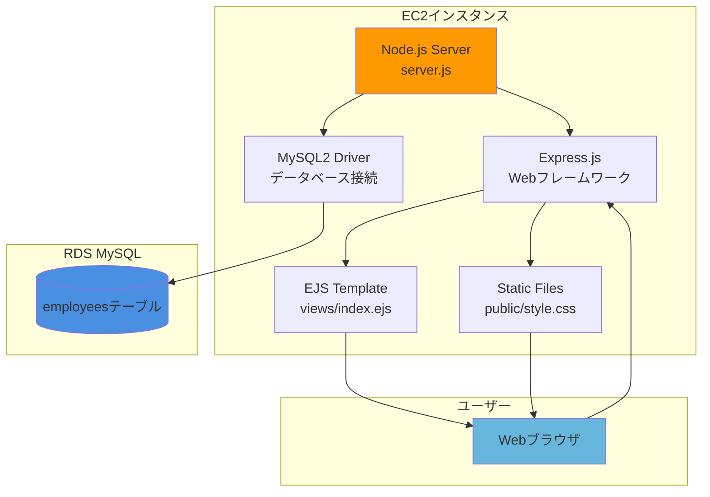
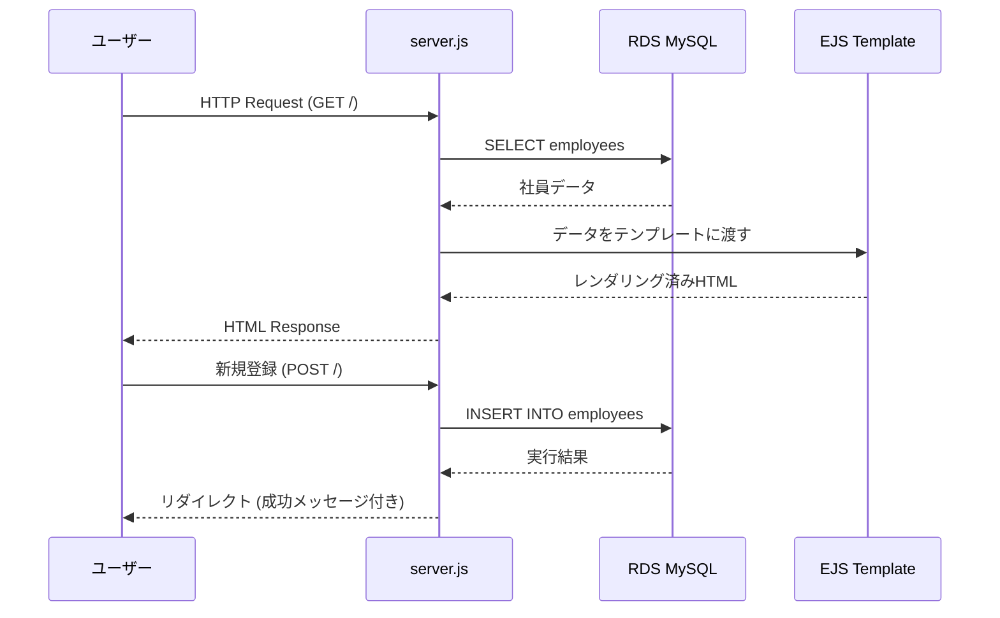

# Node.js社員管理システム - アプリケーション概要

## 📋 アプリケーション概要

このNode.jsアプリケーションは、AWS RDSと連携した**社員管理システム**です。完全なCRUD（Create, Read, Update, Delete）機能を提供し、美しいWebインターフェースを通じて社員情報の管理を行います。

### 🎯 主な機能
- 社員情報の新規登録
- 社員一覧の表示
- 社員情報の編集・更新
- 社員情報の削除
- 統計情報の表示（登録社員数など）

## 📁 ファイル構成

```
/var/www/html/
├── package.json          # プロジェクト設定・依存関係
├── server.js            # メインサーバーファイル
├── init_db.js           # データベース初期化スクリプト
├── public/
│   └── style.css        # スタイルシート
└── views/
    └── index.ejs        # メインテンプレート
```

## 🔧 各ファイルの役割

### 1. `package.json`
- **役割**: プロジェクトの設定と依存関係の定義
- **内容**: 
  - Express.js（Webフレームワーク）
  - MySQL2（データベースドライバー）
  - EJS（テンプレートエンジン）
  - Body-parser（リクエスト解析）

### 2. `server.js`
- **役割**: メインのサーバーアプリケーション
- **機能**:
  - Express.jsサーバーの起動
  - RDSデータベースへの接続
  - ルーティング（GET/POST）の処理
  - CRUD操作の実装
  - エラーハンドリング

### 3. `init_db.js`
- **役割**: データベースの初期化
- **機能**:
  - employeesテーブルの作成
  - サンプルデータの挿入
  - データベース構造の設定

### 4. `public/style.css`
- **役割**: Webインターフェースのスタイリング
- **特徴**:
  - AWS風のデザイン
  - グラデーション効果
  - レスポンシブデザイン
  - モダンなUI/UX

### 5. `views/index.ejs`
- **役割**: メインのHTMLテンプレート
- **機能**:
  - 社員一覧の表示
  - 新規登録フォーム
  - 編集フォーム
  - 削除確認機能
  - 統計情報の表示

## 🏗️ アプリケーション構成図



## 🔄 データフロー



## 🛠️ 技術スタック

| 技術 | 用途 | バージョン |
|------|------|-----------|
| Node.js | サーバーサイドランタイム | - |
| Express.js | Webフレームワーク | ^4.18.2 |
| MySQL2 | データベースドライバー | ^3.6.0 |
| EJS | テンプレートエンジン | ^3.1.9 |
| Body-parser | リクエスト解析 | ^1.20.2 |

## 🎨 UI/UX特徴

- **AWS風デザイン**: クラウドサービスらしい洗練されたインターフェース
- **グラデーション効果**: 美しい視覚効果
- **レスポンシブ対応**: モバイルデバイスでも快適に利用可能
- **直感的操作**: 編集・削除ボタンによる簡単操作
- **リアルタイム統計**: 登録社員数の表示

## 🔐 セキュリティ考慮事項

- SQLインジェクション対策（プリペアドステートメント使用）
- XSS対策（EJSによる自動エスケープ）
- 削除操作の確認ダイアログ
- 入力値の検証とサニタイゼーション

## 📊 データベース構造

```sql
CREATE TABLE employees (
    id INT AUTO_INCREMENT PRIMARY KEY,
    name VARCHAR(100) NOT NULL,
    email VARCHAR(100) NOT NULL UNIQUE,
    department VARCHAR(50),
    created_at TIMESTAMP DEFAULT CURRENT_TIMESTAMP
);
```

このアプリケーションは、AWS Academy Cloud Foundationsの実習において、EC2とRDSの連携を学習するための実践的な教材として設計されています。

---

## ⚠️ セキュリティに関する重要な注意事項

### 🚨 教育目的での制限事項

**このアプリケーションは教育目的で作成されており、わかりやすさと構造のシンプルさを優先しています。本番環境での使用は想定されておらず、以下のセキュリティ上の問題が存在します。**

### 🔓 既知のセキュリティ脆弱性

#### 1. **認証・認可の欠如**
- **問題**: ユーザー認証機能が実装されていない
- **リスク**: 誰でもアクセス可能で、全ての操作が実行できる
- **本番対応**: JWT認証、セッション管理、ロールベースアクセス制御の実装が必要

#### 2. **データベース認証情報のハードコーディング**
```javascript
// ❌ セキュリティリスク
const dbConfig = {
  password: 'password123',  // 平文パスワード
  // ...
};
```
- **問題**: パスワードがソースコードに直接記載
- **リスク**: コードが漏洩した場合、データベースへの不正アクセスが可能
- **本番対応**: 環境変数、AWS Secrets Manager、AWS Systems Manager Parameter Storeの使用

#### 3. **入力値検証の不備**
- **問題**: 基本的な必須チェックのみで、詳細な検証が不十分
- **リスク**: 
  - 異常なデータの挿入
  - XSS攻撃の可能性（EJSで一部軽減されているが完全ではない）
  - データ型不整合
- **本番対応**: 包括的な入力検証ライブラリ（Joi、express-validator等）の使用

#### 4. **エラーハンドリングの情報漏洩**
```javascript
// ❌ 詳細エラー情報の露出
message = '❌ エラー: ' + error.message;
```
- **問題**: データベースエラーの詳細がユーザーに表示される
- **リスク**: システム内部構造の情報漏洩
- **本番対応**: ログ記録と汎用エラーメッセージの分離

#### 5. **HTTPS通信の未実装**
- **問題**: HTTP通信のみ対応
- **リスク**: 通信内容の盗聴、中間者攻撃
- **本番対応**: SSL/TLS証明書の設定、HTTPS強制リダイレクト

#### 6. **CSRF対策の欠如**
- **問題**: Cross-Site Request Forgery対策が未実装
- **リスク**: 悪意のあるサイトからの不正操作
- **本番対応**: CSRFトークンの実装

#### 7. **レート制限の未実装**
- **問題**: API呼び出し回数の制限なし
- **リスク**: DoS攻撃、ブルートフォース攻撃
- **本番対応**: express-rate-limit等の実装

#### 8. **ログ・監査機能の欠如**
- **問題**: 操作ログの記録なし
- **リスク**: セキュリティインシデントの検知・追跡が困難
- **本番対応**: 包括的なログ記録とモニタリング

### ✅ 実装済みのセキュリティ対策

#### 1. **SQLインジェクション対策**
```javascript
// ✅ プリペアドステートメント使用
await db.promise().execute(
  'INSERT INTO employees (name, email, department) VALUES (?, ?, ?)',
  [name.trim(), email.trim(), department.trim()]
);
```

#### 2. **基本的なXSS対策**
- EJSテンプレートエンジンによる自動エスケープ
- ただし、完全ではないため追加対策が必要

### 🎓 教育的価値と学習目標

このアプリケーションの主な学習目標は以下の通りです：

1. **AWS EC2とRDSの連携理解**
2. **Node.js + Express.jsの基本構造習得**
3. **CRUD操作の実装方法学習**
4. **Webアプリケーションの基本アーキテクチャ理解**

### 🔒 本番環境への移行時の必須対応事項

本番環境で使用する場合は、以下の対応が**必須**です：

1. **認証・認可システムの実装**
2. **環境変数による機密情報管理**
3. **包括的な入力検証**
4. **HTTPS通信の強制**
5. **CSRF対策の実装**
6. **レート制限の設定**
7. **包括的なログ・監査機能**
8. **セキュリティヘッダーの設定**
9. **定期的なセキュリティ監査**

### 📚 参考資料

- [OWASP Top 10](https://owasp.org/www-project-top-ten/)
- [Node.js Security Best Practices](https://nodejs.org/en/docs/guides/security/)
- [Express.js Security Best Practices](https://expressjs.com/en/advanced/best-practice-security.html)

**⚠️ 免責事項: このコードは教育目的のみで提供されており、本番環境での使用による如何なる損害についても責任を負いません。**
