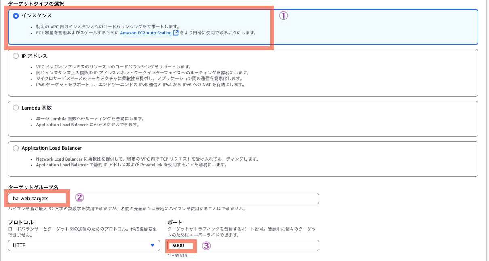

# ⚖️ Day 4: 高可用性システム ハンズオン

> **HA = High Availability（高可用性）**  
> High Availabilityの略語として「HA」は広く使われていますが、  
> リソース名の「ha-」プレフィックスについては  
> 組織や開発者の命名ポリシーによる個別の選択です。  

## 🎯 このハンズオンで学ぶこと

- **高可用性**: 単一障害点を排除したシステム設計
- **Application Load Balancer**: 複数サーバへの負荷分散
- **冗長化**: 障害時でもサービス継続する仕組み
- **可用性テスト**: 実際に障害を発生させて動作確認

## 🏗️ 構築するシステム

```
🌐 インターネット → ⚖️ ALB → 💻 EC2-1(Webアプリ) → 🗄️ RDS(MySQL)
                      ↓    💻 EC2-2(Webアプリ) ↗
                  負荷分散      冗長化構成
```

**動作**: Day3の社員管理システムを2台構成にして、1台停止してもサービス継続

## ⏰ 所要時間

約120分（発表準備時間含む）

## 📋 前提条件

- AWS Academy Sandbox環境へのアクセス
- Day3で学んだVPC・EC2・RDSの知識

---

## 🚀 Phase 1: 基盤構築（Day3の復習）（20分）

Day 3演習内容(VPC + DB Subnet Group + SG + RDS + EC2)と同じものをCloudFormationで構築する。  
手動でもう一度構築することで定着を図れるが、本日はELB(ALB)を利用した高可用性システムの構築に焦点をあてるため、Day 3の内容はCloudFormationを使ってショートカットする。  

「[Day3 Database Lab - CloudFormation版](../../day3/db-lab/cloudformation/README.md)」を参照のこと。  


## 🚀 Phase 2: 高可用性Webサーバ構築（25分）


### Step 1: 2台目のEC2インスタンス作成（10分）

1. **EC2コンソール**→「インスタンスを起動」

#### 基本設定
- **名前**: `ha-web-server-2`
- **AMI**: Amazon Linux 2023 AMI
- **インスタンスタイプ**: t3.micro

#### キーペア（ログイン）

- キーペアなしで続行（推奨されません）

#### ネットワーク設定
- **VPC**: `employee-app-vpc-cf`
- **サブネット**: パブリックサブネット2（異なるAZ）
- **パブリックIP**: 有効

#### セキュリティグループ
- **既存選択**: `Day3DbLabStack-WebServerSecurityGroup-xxxx` (`xxxx`実行環境ごとに異なる。**WebServerSecurityGroup**を選ぶこと!!!)

#### 高度な詳細
- **IAMプロファイル**: `LabInstanceProfile`
  
  > **AWS Academy環境ではない方は**: セッションマネージャーを使用するため、`AmazonSSMManagedInstanceCore`ポリシーがアタッチされたIAMロールを作成し、インスタンスプロファイルとして設定してください。

- **ユーザーデータ**: <a href="https://github.com/haw/aws-education-materials/blob/main/day3/db-lab/materials/user-data-webapp.txt" target="_blank" rel="noopener noreferrer">user-data-webapp.txt</a> の内容をコピー & ペースト  
    - `YOUR_RDS_ENDPOINT_HERE`を`[RDSエンドポイント]`(※次参照)で書き換える（先頭の方に1箇所）
    - `[RDSエンドポイント]` = RDSコンソール→データベース→`employee-database-cf`→接続とセキュリティ→エンドポイントの値 (RDSのコンソールに戻っても表示されない場合は待つ。「待つ」のも仕事のうち!)


      


#### 1台目で動作確認（employee-web-server-cf）

1. **動作確認**:
    ```bash
    # 1台目のパブリックIPでアクセステスト（ブラウザでアクセスする）
    http://[1台目のパブリックIP]:3000
    ```

     1台目は、CloudFormationで立ち上げているので、確実に動作する。  
     動作しない場合は、ある意味、当たりを引いた!?  ハズレかも...  

#### 2台目で動作確認（ha-web-server-2）

_「ステータスチェック」に合格していること。_

1. **Session Manager**で`ha-web-server-2`に接続
2. **ユーザー切り替え**:
    ```bash
    sudo su - ec2-user
    ```

3. アプリケーションの状態を確認
    ```bash
    sudo systemctl status employee-app
    ```

    **以下のようなログがでていれば成功**  =>  手順7(**動作確認**)へ進む(手順4〜6はスキップ)

    ```
    ● employee-app.service - Employee Management Node.js App
         Loaded: loaded (/etc/systemd/system/employee-app.service; enabled; preset: disabled)
         Active: active (running) since Wed 2025-09-03 07:31:47 UTC; 5min ago
       Main PID: 26973 (node)
          Tasks: 11 (limit: 4564)
         Memory: 23.8M
            CPU: 492ms
         CGroup: /system.slice/employee-app.service
                 └─26973 /usr/bin/node server.js

    Dec 19 14:17:20 ip-10-0-1-181.ec2.internal systemd[1]: Started employee-app.service - Employee Management System.
    Dec 19 14:17:21 ip-10-0-1-181.ec2.internal node[25390]: [CONFIG] Secrets Manager not available. Using default values.
    Dec 19 14:17:21 ip-10-0-1-181.ec2.internal node[25390]: サーバーがポート3000で起動しました
    Dec 19 14:17:21 ip-10-0-1-181.ec2.internal node[25390]: データベースに接続しました
    ```

    **失敗している場合は、2台目のサーバのRDSエンドポイントの設定に問題がある**  

    - ユーザーデータ内のRDSエンドポイント（`YOUR_RDS_ENDPOINT_HERE`） を書き換えなかったかもしくは、正しく設定をしなかった → 以降の手順4〜6を行い、応急処置をする  

4. データベースエンドポイント設定を変更

    **RDSコンソールにて、作成したデータベースの状態が「利用可能」となっていることを確認する。**  
    「利用可能」となるまで待つ。  

    ```bash
    cd /var/www/html
    nano config.js
    ```

    `nano` コマンドで、 `config.js` ファイルを書き換える。  
    `nano` コマンドの使い方は次の通りである。  
    - カーソルの移動は矢印キー
    - 保存は、Ctl + O ののち、エンター
    - 終了は、Ctl + X

5. Node.jsアプリケーション再起動（設定反映のため）
    ```bash
    sudo systemctl restart employee-app
    ```

6. 起動確認
    ```bash
    sudo systemctl status employee-app
    ```

    上記でも解決しない場合は、以下のコマンドでエラー原因をつきとめて修正する必要がある。EC2インスタンスを終了し、もう一度EC2インスタンスを作り直すほうが早いかもしれない。  

    ```
    sudo cloud-init status
    sudo cat /var/log/cloud-init-output.log
    sudo tail -f /var/log/cloud-init-output.log
    sudo cat /var/log/cloud-init.log
    sudo systemctl status employee-app
    ```

7. **動作確認**:
    ```bash
    # 2台目のパブリックIPでアクセステスト（ブラウザでアクセスする。⚠️`http`です。`3000`番ポートです。)
    http://[2台目のパブリックIP]:3000
    ```


---

## 🚀 Phase 3: Application Load Balancer構築（10分）

### Step 1: ターゲットグループ作成（5分）

1. **EC2コンソール**→「ターゲットグループ」→「ターゲットグループの作成」

#### 基本設定
- **ターゲットタイプ**: インスタンス
- **ターゲットグループ名**: `ha-web-targets`
- **プロトコル**: HTTP、**ポート**: **3000** (※ デフォルト値を選択してから上書きするように編集すると編集しやすい)
- **VPC**: `employee-app-vpc-cf`



#### ヘルスチェック
- **ヘルスチェックパス**: `/`
- **ヘルスチェックの詳細設定**
  - **正常しきい値**: 2 （デフォルト値 `5` から変更） ※ 通常は`5`のままでよい。演習のため正常しきい値を下げる。  
  - **間隔**: 30秒
  - ヘルスチェック間隔30秒×しきい値2=最低60秒

「**次へ**」  

#### ターゲット登録
- `employee-web-server-cf`と`ha-web-server-2`を選択し、「保留中として以下を含める」
- **ターゲットグループの作成**


### Step 2: Application Load Balancer作成（5分）

1. **EC2コンソール**→「ロードバランサー」→「ロードバランサーの作成」

#### 基本設定
- **タイプ**: Application Load Balancer
- **名前**: `ha-system-alb`
- **スキーム**: インターネット向け

#### ネットワークマッピング
- **VPC**: `employee-app-vpc-cf`
- **サブネット**: 両AZの**パブリック**サブネットを選択


#### セキュリティグループ
- **新規作成**: `ha-alb-sg` (「名前」と「説明」を入力する)
- **VPC**: `employee-app-vpc-cf`
- **インバウンドルール**: HTTP (80): 0.0.0.0/0 (Anywhere-IPv4)
- **アウトバウンドルール**: ⚠️変更しないこと

※「新しいセキュリティグループを作成↗」リンクから作成可能です。作成後、「更新🌀」ボタンを押下して選択してください。  


#### リスナーとルーティング
- **プロトコル**: HTTP、**ポート**: 80 (※ クライアント -- (80) --> ALB -- (3000) --> EC2)
- **デフォルトアクション**: `ha-web-targets`に転送

その他は、デフォルトのまま、「ロードバランサーの作成」  

---

## 🔒 Phase 4: セキュリティ強化（5分）

### Step 1: Webサーバセキュリティグループ更新

1. **EC2コンソール**→「セキュリティグループ」
2. `employee-web-server-sg-cf`を選択
3. 「インバウンドルール」→「インバウンドルールを編集」
4. **既存ルール削除**: カスタムTCP (3000): 0.0.0.0/0
5. **新規ルール追加**: 
   - **タイプ**: カスタムTCP
   - **ポート**: 3000
   - **ソース**: `ha-alb-sg`（ALBのセキュリティグループを選択）

💡 **セキュリティ向上**: これでWebサーバへの直接アクセスを防ぎ、ALB経由のみに制限されます

---

## 🚀 Phase 5: 高可用性テスト（10分）

### Step 1: 正常動作確認（3分）

_状態(ステータス)が **アクティブ** であること_

1. **ALBのDNS名**をコピー
2. ブラウザで`http://[ALB-DNS名]`にアクセス
3. 社員管理システムが表示されることを確認
4. 社員データを追加して動作確認


### Step 2: 可用性テスト（5分）

1. **EC2コンソール**で`employee-web-server-cf`を選択
2. 「インスタンスの状態」→「インスタンスを停止」
3. **ブラウザを更新**してシステムが継続動作することを確認 （ページが表示されない場合やcssが効かず装飾がつかない場合がありますが、1分程度待つと正常に表示されます）
4. **ターゲットグループ**でヘルスチェック状況を確認 (「更新」をする必要がある場合があります。 `ha-web-server-2` のみHealthy状態のはずです)

### Step 3: 復旧テスト（2分）

1. 停止したインスタンスを「開始」
2. ターゲットグループで「Healthy」に戻ることを確認 （手順1のあと1分程度待つ必要があります）
3. 負荷分散が再開されることを確認

---

## 📸 発表準備のポイント

### 🎯 スクリーンショット推奨箇所

1. **システム構成図**: VPC、EC2×2、ALB、RDSの配置
2. **ALBターゲットグループ**: 両方のインスタンスがHealthy
3. **正常動作**: ALB経由でのアプリケーション画面
4. **障害テスト**: 1台停止時の継続動作
5. **ヘルスチェック**: Unhealthy→Healthyの変化

### 💡 発表で語るべきポイント

- **単一障害点の排除**: 1台停止してもサービス継続
- **負荷分散の効果**: トラフィック分散によるパフォーマンス向上
- **ヘルスチェック**: 自動的な障害検知と切り離し
- **マルチAZ配置**: 異なるデータセンターでの冗長化
- **セキュリティ強化**: ALB経由のみのアクセス制限で多層防御を実現

<a href="../../day5/materials/presentation_format.html" target="_blank" rel="noopener noreferrer">成果発表フォーマット</a>  

---

## 👑 Day 4 完走賞 🎉🎉🎉

<a href="https://github.com/haw/aws-education-hands-on/blob/main/day4/ha-system-lab/cloudformation/day4-ha-employee-app.yaml" target="_blank" rel="noopener noreferrer">day4-ha-employee-app.yaml</a>  

Day 4完了時点の完成形を作れるCloudFormationテンプレートをプレゼント🎁します。  
スタック名は、たとえば「Day4CompleteStack」とでもつけてください。  

---

## 🎯 学習ポイント

### **高可用性の実現**
- **冗長化**: 複数のサーバで同じサービスを提供
- **負荷分散**: トラフィックを複数サーバに分散
- **自動復旧**: 障害サーバの自動切り離しと復帰

### **Application Load Balancerの価値**
- **Layer 7負荷分散**: HTTPレベルでの高度な制御
- **ヘルスチェック**: 自動的な障害検知
- **スケーラビリティ**: サーバ台数の柔軟な増減

### **セキュリティ設計**
- **多層防御**: ALBとEC2で二重のセキュリティ制御により、単一の防御線に依存しない堅牢な構成
- **最小権限の原則**: 必要最小限のアクセスのみ許可し、攻撃対象領域を最小化
- **ネットワーク分離**: 直接アクセスの防止により、Webサーバを外部から隠蔽
- **本番運用設計**: 実際のWebサービスで使われるセキュリティ設計パターンの実践

### **本番運用への応用**
- **Auto Scaling**: 負荷に応じた自動スケーリング
- **CloudWatch**: 監視とアラート
- **マルチAZ RDS**: データベースの高可用性

---

## 🚨 トラブルシューティング

### **ALBでアクセスできない**
1. セキュリティグループでポート80が開いているか確認
2. ターゲットグループのヘルスチェック状況確認
3. EC2インスタンスが正常に起動しているか確認

### **ヘルスチェックがUnhealthy**
1. EC2インスタンスでNode.jsアプリケーションが起動しているか確認: `sudo systemctl status employee-app`
2. ユーザーデータスクリプトが正常実行されたか確認
3. セキュリティグループでALBからのポート3000への通信が許可されているか確認

### **データベース接続エラー**
1. RDSセキュリティグループでEC2からの接続が許可されているか確認
2. config.jsのエンドポイント設定確認
3. 初期データベース名の設定確認
4. Node.jsアプリケーションログ確認: `sudo journalctl -u employee-app.service -f`

---

## 🎊 完了！

おめでとうございます！あなたは今、以下を達成しました：

✅ **高可用性システム**: 単一障害点を排除した冗長構成  
✅ **負荷分散**: Application Load Balancerによるトラフィック分散  
✅ **障害対応**: 1台停止してもサービス継続する仕組み  
✅ **セキュリティ強化**: ALB経由のみのアクセスで多層防御を実現  
✅ **本番レベル**: 実際のWebサービスで使われる構成  

### 🚀 明日の発表会に向けて

今日構築したシステムは、実際のWebサービスで使われている本格的な高可用性構成です。明日の発表では、この経験を活かして、クラウドエンジニアとしての成長をアピールしましょう！

### 💡 今日の気づきを記録しよう

- 単一障害点とは何か？どう解決したか？
- 負荷分散の仕組みと効果は？
- 高可用性システムの設計思想は？

**明日の発表、頑張りましょう！** 🔥

---

### 💪 余力のある人は

[スケーラブルウェブサイト構築 ハンズオン - シンプルモード](https://catalog.us-east-1.prod.workshops.aws/workshops/47782ec0-8e8c-41e8-b873-9da91e822b36/ja-JP/simple-mode) で、WordPressを動かすことができます。余力のある人は挑戦してみてください💪  

ただし、AWS Academyのサンドボックス環境では読み替えが必要な箇所があります:  

- **リージョン** はログインしたときのリージョンのまま変えないこと
- *2-a. Systems Manager の有効化* はIAMロールの作成ができないのでスキップ(飛ばす)
- *2-b*: EC2インスタンスのOSはAmazon Linux 2023を選ぶ
- *2-b*: 3-4. キーペアの設定は、vockeyを選ぶ
- *2-b*: Windows Server 2022はスキップ（飛ばす）
- *3-c*: 3-7. 追加の設定 は「ログのエクスポート」の位置が変わっている
- *4*. WordPress の設定: (オプション) 2. EC2インスタンス上のアクセスログを確認 は、オプションですので、飛ばしてもよいです
