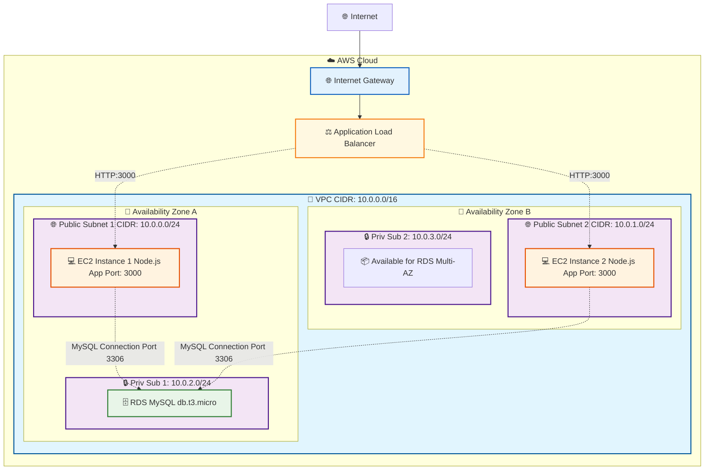

# Day4 HA System Lab - System Architecture

## 🏗️ AWS High Availability System Architecture Diagram

This diagram shows the AWS resources created by the `day4-ha-employee-app.yaml` CloudFormation template.

## 📋 System Components

### 🌐 Network Infrastructure
- **VPC**: CIDR 10.0.0.0/16
- **Internet Gateway**: Internet connectivity
- **Public Subnets**: 2 subnets across different AZs for web servers
- **Private Subnets**: 2 subnets for database isolation

### ⚖️ Load Balancing & High Availability
- **Application Load Balancer**: Distributes traffic across multiple EC2 instances
- **Multi-AZ Deployment**: EC2 instances in different availability zones

### 💻 Compute Resources
- **EC2 Instance 1**: Located in Public Subnet 1 (AZ-A)
- **EC2 Instance 2**: Located in Public Subnet 2 (AZ-B)
- **Application**: Node.js Employee Management System on both instances
- **Port**: 3000 (HTTP) for application access

### 🗄️ Database Resources
- **RDS MySQL**: Located in Private Subnet 1 (AZ-A)
- **Engine**: MySQL 8.4.3
- **Instance Class**: db.t3.micro
- **Database**: employeedb
- **Multi-AZ Ready**: Private Subnet 2 available for RDS Multi-AZ

## 🎯 High Availability Features

### ✅ Fault Tolerance
- **Multiple EC2 Instances**: If one instance fails, traffic routes to healthy instance
- **Health Checks**: ALB automatically detects and removes unhealthy instances
- **Multi-AZ Architecture**: Resources distributed across availability zones

### ✅ Load Distribution
- **Application Load Balancer**: Distributes incoming requests across instances
- **Target Group**: Manages instance health and traffic routing
- **Scalability**: Easy to add more instances to handle increased load

### ✅ Security & Isolation
- **Database Isolation**: RDS in private subnet (no internet access)
- **Layered Architecture**: Internet → ALB → EC2 → RDS
- **Security Groups**: Restrict access between tiers

## 🔄 Traffic Flow

### 📥 Incoming Requests
1. **User** → Internet (HTTP:80)
2. **Internet** → Internet Gateway
3. **IGW** → Application Load Balancer
4. **ALB** → EC2 Instance (HTTP:3000)

### 🗄️ Database Access
1. **EC2 Instance 1** → RDS MySQL (Port 3306)
2. **EC2 Instance 2** → RDS MySQL (Port 3306)
3. **Shared Database**: Both instances access same data

## 🎓 Educational Value

### ✅ High Availability Concepts
- **Redundancy**: Multiple instances prevent single points of failure
- **Load Balancing**: Even distribution of traffic
- **Health Monitoring**: Automatic failure detection and recovery

### ✅ AWS Best Practices
- **Multi-AZ Deployment**: Geographic distribution for resilience
- **Proper Subnet Design**: Public for web, private for database
- **Security Layering**: Defense in depth architecture

### ✅ Real-World Application
- **Production-Ready Pattern**: Scalable and fault-tolerant design
- **Cost-Effective**: Efficient resource utilization
- **Maintainable**: Clear separation of concerns
