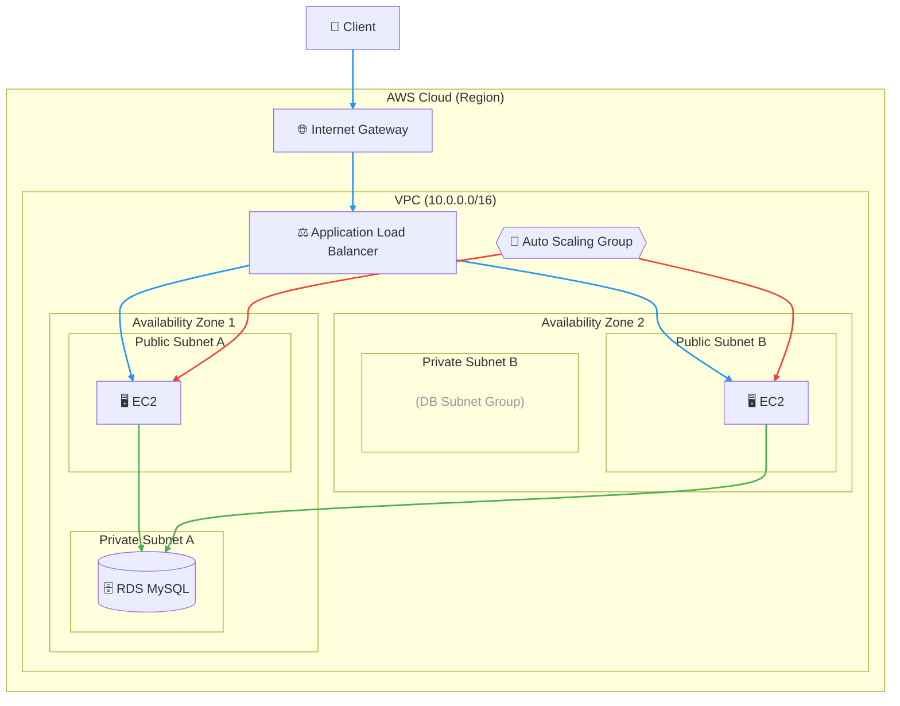

# 🚀 Day X: Auto Scaling ハンズオン

## 概要

高可用性・スケーラブルなWebアプリケーションを構築する。
Day 3/4で構築した社員管理システムをAuto Scaling対応にする。

## 最終構成

- VPC (Public Subnet x 2, Private Subnet x 2)
- RDS MySQL (Private Subnet)
- EC2 + Auto Scaling + ALB (Public Subnet)

## システム構成図



**凡例**: 🔵HTTPトラフィック / 🟢DB接続 / 🔴Auto Scaling

## 前提条件

- AWS Academy Sandbox環境へのアクセス
- Day 3/4で学んだVPC・EC2・RDSの知識

## ⏰ 所要時間

約90分

---

## Phase 1: VPC構築（VPCなど で一括作成）

VPCコンソール → **VPCを作成**

### 設定

- 作成するリソース: **VPCなど**
- 名前タグの自動生成: `employee-app` と入力
- IPv4 CIDR ブロック: `10.0.0.0/16`
- アベイラビリティゾーン(AZ)の数: **2**
- パブリックサブネットの数: **2**
- プライベートサブネットの数: **2**
- NAT ゲートウェイ: **なし**
- VPC エンドポイント: **なし**

**VPCを作成** をクリック。

これで以下が一括作成される:
- VPC
- Internet Gateway
- パブリックサブネット x 2
- プライベートサブネット x 2
- ルートテーブル（パブリック用・プライベート用）

---

## Phase 2: セキュリティグループ作成

### 2-1. Web用セキュリティグループ

EC2コンソール → **セキュリティグループ** → **セキュリティグループを作成**

- セキュリティグループ名: `employee-web-sg`
- 説明: `Security group for web servers`
- VPC: employee-app-vpc
- インバウンドルール: ルールを追加
  - タイプ: **カスタムTCP**, ポート: **3000**, ソース: **Anywhere-IPv4** (0.0.0.0/0)
- ⚠️アウトバウンドルールは変更しないこと
- セキュリティグループを作成

### 2-2. DB用セキュリティグループ

- セキュリティグループ名: `employee-db-sg`
- 説明: `Security group for database`
- VPC: employee-app-vpc
- インバウンドルール: ルールを追加
  - タイプ: **MYSQL/Aurora**, ソース: **カスタム** → `employee-web-sg` を選択
- ⚠️アウトバウンドルールは変更しないこと
- セキュリティグループを作成

---

## Phase 3: RDS作成

### 3-1. DBサブネットグループ作成

RDSコンソール → **サブネットグループ** → **DBサブネットグループを作成**

- 名前: `employee-db-subnet-group`
- 説明: `employee-db-subnet-group`
- VPC: employee-app-vpc
- アベイラビリティゾーン: 両方選択
- サブネット: **プライベートサブネット** を2つ選択
- 作成

### 3-2. RDSインスタンス作成

**データベース** → **データベースの作成**

- データベースの作成方法を選択: **標準作成**
- エンジンのオプション: **MySQL**
- テンプレート: **無料利用枠**
- DBインスタンス識別子: `employee-database`
- マスターユーザー名: `admin`
- 認証情報管理: `セルフマネージド`
- マスターパスワード: `password123`
- マスターパスワードを確認: `password123`
- VPC: employee-app-vpc
- DBサブネットグループ: employee-db-subnet-group
- パブリックアクセス: **なし**
- VPC セキュリティグループ: **既存の選択** → **employee-db-sg**（defaultは削除）
- 追加設定 → 最初のデータベース名: `employeedb`
- データベースの作成

作成が完了するまで5分ほどかかる。  
作成後、**RDSのエンドポイント** をメモしておく。

---

## Phase 4: EC2インスタンス作成（単体動作確認）

### 4-1. EC2起動

EC2コンソール → **インスタンスを起動**

- 名前: `employee-web-server`
- AMI: **Amazon Linux 2023**
- インスタンスタイプ: t3.micro
- キーペア: **vockey**（またはキーペアなしで続行）
- ネットワーク設定:
  - 編集
  - VPC: employee-app-vpc
  - サブネット: **パブリックサブネット1**
  - パブリックIPの自動割当: **有効化**
  - セキュリティグループ: **既存のセキュリティグループを選択する** → **employee-web-sg**
- 高度な詳細:
  - IAM インスタンスプロフィール: **LabInstanceProfile**
  - ユーザーデータ（一番下）: 以下を貼り付け

⚠️ `YOUR_RDS_ENDPOINT_HERE` を実際のRDSエンドポイントに置換すること

```bash
#!/bin/bash
set -euxo pipefail

RDS_ENDPOINT="YOUR_RDS_ENDPOINT_HERE"

dnf -y update
dnf -y install git nodejs npm mariadb105

mkdir -p /var/www/html
chmod 755 /var/www/html

WORKDIR=/opt/employee-app-src
rm -rf "$WORKDIR"
mkdir -p "$WORKDIR"
cd "$WORKDIR"

git init
git remote add origin https://github.com/haw/aws-education-hands-on.git
git config core.sparseCheckout true
git sparse-checkout init --cone || true
echo "day3/db-lab/materials/app/*" > .git/info/sparse-checkout
git fetch --depth=1 origin main
git checkout -b main origin/main

cp -r day3/db-lab/materials/app/* /var/www/html/
cd /var/www/html

sed -i "s/YOUR_RDS_ENDPOINT_HERE/$RDS_ENDPOINT/g" init_db.js
sed -i "s/YOUR_RDS_ENDPOINT_HERE/$RDS_ENDPOINT/g" server.js

# seedデータ挿入部分を削除（Auto Scaling時に毎回挿入されるのを防ぐ）
sed -i '/\/\/ Insert sample data/,/サンプルデータを挿入しました/d' init_db.js

npm install

chown -R ec2-user:ec2-user /var/www/html

cat > /etc/systemd/system/employee-app.service <<'SERVICE'
[Unit]
Description=Employee Management Node.js App
After=network.target

[Service]
Type=simple
User=ec2-user
WorkingDirectory=/var/www/html
ExecStart=/usr/bin/node server.js
Restart=always
RestartSec=10
Environment=NODE_ENV=production

[Install]
WantedBy=multi-user.target
SERVICE

systemctl daemon-reload
systemctl enable employee-app

RETRY_COUNT=0
while ! mysqladmin ping -h $RDS_ENDPOINT -u admin -ppassword123 --silent; do
  RETRY_COUNT=$((RETRY_COUNT + 1))
  if [ $RETRY_COUNT -ge 60 ]; then
    echo "RDS connection timeout"
    break
  fi
  echo "Waiting for RDS... ($RETRY_COUNT/60)"
  sleep 30
done

node init_db.js || true

systemctl start employee-app
```

- インスタンスを起動
- ステータスチェックが完了するまで待つ(3分〜5分)

### 4-2. 動作確認

ブラウザで `http://<EC2のパブリックIP>:3000` にアクセス。

- 社員レコードの追加・編集・削除ができることを確認
- **https ではなく http** を使用すること
- ポートは **3000**

---

## Phase 5: AMI作成

1. EC2コンソール → **employee-web-server** を選択
2. **アクション** → **イメージとテンプレート** → **イメージを作成**
3. イメージ名: `employee-app-ami`
4. 他はデフォルトのまま
5. **イメージを作成**

AMIのステータスが **利用可能** になるまで待つ（3分〜5分）

---

## Phase 6: ELB用セキュリティグループ作成

EC2コンソール → **セキュリティグループ** → **セキュリティグループを作成**

- セキュリティグループ名: `employee-alb-sg`
- 説明: `Security group for ALB`
- VPC: employee-app-vpc
- インバウンドルール: ルールを追加
  - タイプ: **HTTP**, ソース: **Anywhere-IPv4** (0.0.0.0/0)
- ⚠️アウトバウンドルールは変更しないこと
- セキュリティグループを作成

### Web SGのインバウンド修正

**employee-web-sg** を編集(インバウンドのルールを編集):
- 既存のカスタムTCP (0.0.0.0/0) ルールを削除
- 新規追加: タイプ: **カスタムTCP**, ポート: **3000**, ソース: **カスタム** → `employee-alb-sg`
- ルールを保存

---

## Phase 7: ターゲットグループ作成

EC2コンソール → **ターゲットグループ** → **ターゲットグループの作成**

- ターゲットの種類: **インスタンス**
- ターゲットグループ名: `employee-tg`
- プロトコル: HTTP, ポート: **3000**
- VPC: employee-app-vpc
- Health check path: `/`
- **次へ** → ターゲットは登録せずに → **ターゲットグループの作成**

---

## Phase 8: Application Load Balancer作成

EC2コンソール → **ロードバランサー** → **ロードバランサーの作成** → **Application Load Balancer**

- ロードバランサー名: `employee-alb`
- スキーム: インターネット向け
- ネットワークマッピング:
  - VPC: employee-app-vpc
  - アベイラビリティゾーンとサブネット: 両方のAZを選択、それぞれ **パブリックサブネット** を選択
- セキュリティグループ: **employee-alb-sg**（defaultは削除）
- リスナーとルーティング:
  - プロトコル: HTTP, ポート: 80
  - デフォルトアクション: ターゲットグループへの転送 **employee-tg**
- ロードバランサーの作成

作成後、**DNS name** をメモ。

---

## Phase 9: 起動テンプレート作成

EC2コンソール → **起動テンプレート** → **起動テンプレートを作成**

- 起動テンプレート名: `employee-template`
- テンプレートバージョンの説明: `Employee app for Auto Scaling`
- Auto Scaling のガイダンス: チェックを入れる
- アプリケーションおよび OS イメージ: **自分のAMI** → **employee-app-ami**
- インスタンスタイプ: **t3.micro**
- キーペア: **vockey**（またはキーペアなしで続行）
- ネットワーク設定:
  - サブネット: 起動テンプレートの設定に含めない
  - ファイアウォール: **既存のセキュリティグループを選択する** → **employee-web-sg**
  - 高度なネットワーク設定: 「パブリックIPの自動割り当て」を **有効化**
- 高度な詳細:
  - IAM instance profile: **LabInstanceProfile**
  - CloudWatch モニタリングの詳細: **有効化**
- 起動テンプレートを作成

---

## Phase 10: Auto Scaling グループ作成

EC2コンソール → **Auto Scaling グループ** → **Auto Scalingグループを作成する**

### Step 1: 起動テンプレートを選択
- Auto Scaling グループ名: `employee-asg`
- 起動テンプレート: **employee-template**
- 次へ

### Step 2: インスタンス起動オプションを選択する
- VPC: employee-app-vpc
- アベイラビリティゾーンとサブネット: **パブリックサブネット** を2つ選択
- 次へ

### Step 3: 他のサービスと統合する
- ロードバランシング: **既存のロードバランサーにアタッチする**
- ロードバランサーのターゲットグループから選択する: **employee-tg**
- ヘルスチェック: **Elastic Load Balancing のヘルスチェックをオンにする**
- 次へ

### Step 4: グループサイズとスケーリング
- 希望するキャパシティ: `2`
- 最小の希望する容量: `1`
- 最大の希望する容量: `4`
- 自動スケーリング: **ターゲット追跡スケーリングポリシー**
  - スケーリングポリシー名: Target Tracking Policy
  - メトリクスタイプ: 平均CPU使用率
  - ターゲット値: `50`
- 次へ

### Step 5: 通知を追加する
- スキップ
- 次へ

### Step 6: タグを追加する
- キー: `Name`, 値: `employee-auto-scaling`

### Step 7: 確認
- **Auto Scaling グループを作成する**

---

## Phase 11: 動作確認

Auto Scalingで自動的にインスタンスが立ち上がるまで3分〜5分程度待つ。

1. ブラウザで `http://<ALBのDNS名>` にアクセス
2. 社員レコードの追加・編集・削除ができることを確認
3. EC2コンソールで Auto Scaling によりインスタンスが起動していることを確認

---

## Phase 12: 負荷テストでスケールアウト確認

### 12-1. 負荷テスト用EC2インスタンス作成

EC2コンソール → **インスタンスを起動**

- 名前: `load-test-server`
- AMI: **Amazon Linux 2023**
- インスタンスタイプ: t3.micro
- キーペア: **vockey**
- ネットワーク設定:
  - VPC: employee-app-vpc
  - サブネット: **パブリックサブネット1**
  - パブリックIPの自動割当: **有効化**
  - セキュリティグループ: **default**
- 高度な詳細:
  - IAM インスタンスプロフィール: **LabInstanceProfile**
- インスタンスを起動

### 12-2. Session Managerで接続

EC2コンソール → **load-test-server** を選択 → **接続** → **セッションマネージャー** → **接続**

### 12-3. loadtestインストール

```bash
sudo dnf install -y nodejs npm
sudo npm install -g loadtest
```

### 12-4. 負荷テスト実行

`<ALBのDNS名>` を実際の値に置換して実行:

```bash
loadtest --rps 2000 -c 1000 -k -t 300 http://<ALBのDNS名>
```

⚠️ スケールアウトが発生するまで数分かかる。

### 12-5. スケールアウト確認

1. EC2コンソール → インスタンス一覧で `employee-auto-scaling` が増えることを確認
2. または Auto Scaling グループ → **employee-asg** → **アクティビティ** タブで確認

### 12-6. スケールイン確認

1. 負荷テストを `Ctrl+C` で停止
2. しばらく待つとインスタンス数が最小値（1）まで減少することを確認

### 12-7. 後片付け

負荷テスト用EC2インスタンス **load-test-server** を終了（削除）する。

---

## トラブルシューティング

### アプリが起動しない場合

Session Managerで接続し、状態確認:

```bash
sudo su - ec2-user
sudo systemctl status employee-app
```

### RDSに接続できない場合

- セキュリティグループ（employee-db-sg）の設定を確認
- RDSのエンドポイントが正しいか確認
- RDSが「利用可能」状態か確認

### Auto Scalingでスケールアウトしない場合

- 動的スケーリングポリシーが作成されているか確認
- CloudWatchアラームが作成されているか確認
- Auto Scaling グループ → 自動スケーリング タブで確認
